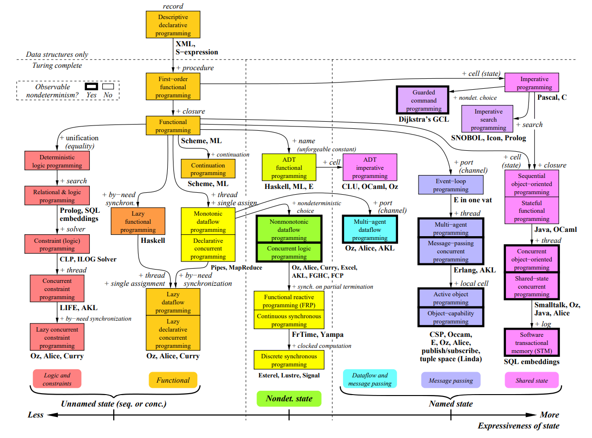

# 编程范式

编程范式（Programming Paradigm）这一概念最早可追溯到Robert W. Floyd在1978年所作的演讲“The Paradigms of Programming”，后来逐渐被用来划分构建程序的不同方式。每种范式代表着一种“思想”或者“方法论”，对代码的结构和风格产生影响。

## 过程式

过程（Procedural）可被认为等同于函数（Function），用过程式思想写出的代码由一个个函数组成，程序的执行过程就是函数间的相互调用。

过程式是最基本的范式，现代采用冯诺依曼体系的计算机，最底层的机器码就是过程式的。一路走来，它自然是最为开发者熟悉，也是最广泛使用的范式。接近系统底层的重要语言，包括C、汇编，都是过程式的。

```c
typedef struct
{
    double x;
    double y;
} Point;

double calc_distance(Point p1, Point p2)
{
    double delta_x = p1.x - p2.x;
    double delta_y = p1.y - p2.y;
    return sqrt(delta_x * delta_x + delta_y * delta_y);
}

int main()
{
    Point p1 = { .x = 0.0, .y = 1.0 };
    Point p2 = { .x = 2.0, .y = 3.0 };
    double distance = calc_distance(p1, p2);
    printf("%f", distance);
    return 0;
}
```

## 面向对象

面向对象编程（OOP）试图用Object来组织和抽象程序的所有功能。Object封装了数据（Data Fields）和操作数据的函数（Member Functions）供外部调用。

很多现代编程语言都支持OOP，应用非常普遍，包括C++、Java、Python和C#等。其中，C++不仅支持OOP还支持过程式，而Java/C#等语言从最顶层看就仅支持OOP一种编程范式，即使是作为程序入口的main函数也必须被包含在一个类中。

```csharp
public class Point
{
    public Point(double x, double y)
    {
        this.x = x;
        this.y = y;
    }
    public double CalcDistance(Point p)
    {
        double delta_x = this.x - p.x;
        double delta_y = this.y - p.y;
        return Math.Sqrt(delta_x * delta_x + delta_y * delta_y);
    }
    private double x;
    private double y;
}
                    
public class Program
{
    public static void Main()
    {
        Point p1 = new Point(0.0, 1.0);
        Point p2 = new Point(2.0, 3.0);
        double distance = p1.CalcDistance(p2);
        Console.WriteLine($"{distance}");
    }
}
```

## 函数式

函数式编程出现于上世纪五十年代，它的特点是视函数为“第一等公民（First Class）”，和普通数据变量拥有同等地位。

极少有完全函数式的语言在工业界广泛应用，函数范式更多时候是通过lambda函数在非函数式语言中被局部运用。限于篇幅，本节仅挑选[高阶函数（Higher Order Function）](http://www.shido.info/lisp/scheme8_e.html)这一个被很多非函数式语言广泛吸收的函数式特性。

所谓高阶函数，即接收函数作为参数的函数。

```lisp
; 自定义比较函数作为参数，传递给排序函数
(sort '(7883 9099 6729 2828 7754 4179 5340 2644 2958 2239) 
      (lambda (x y) (< (modulo x 100) (modulo y 100))))
⇒ (2828 6729 2239 5340 2644 7754 2958 4179 7883 9099)
```

高阶函数可以用来分离可变部分和不可变部分，从而提高代码的模块化程度和复用性。上面的例子中，排序函数关注排序算法本身，不关注比较函数如何实现，由用户提供具体的比较逻辑定制出不同的实现。

这一特性近来被大多数OOP语言吸收了，例如C++中的[std::transform](https://en.cppreference.com/w/cpp/algorithm/transform)就是例子之一。

```c++
// 将字符原地转为大写
std::string s("hello");
std::transform(s.begin(), s.end(), 
               s.begin(),
               [](unsigned char c) -> unsigned char { return std::toupper(c); });
```

## 编程范式体系

过程式、面向对象和函数式都是很常用的编程范式，但是它们不是编程范式的全部。根据Van Roy的[整理](https://www.info.ucl.ac.be/~pvr/VanRoyChapter.pdf)，编程范式目前形成了一个[丰富多元的体系](https://en.wikipedia.org/wiki/Programming_paradigm)。从更高的层面看，各种编程范式通常被划分为两个大类：

* 命令式（Imperative），过程式和面向对象都属于此类。
* 声明式（Declarative），函数式属于此类。



命令式是很常见的编程方式，程序的状态（即数据）随着代码一行行执行被改变，代码定义了怎样（How）做某件事情的全部操作步骤。

```python
items = [1, 2, 3, 4, 5]
squared = []
for i in items:
    squared.append(i**2)
```

而声明式则不同，它通常只声明要做到什么（What），并不关心如何做到。

```python
# 声明需要把列表每个元素平方，不关心遍历循环的实现细节。
items = [1, 2, 3, 4, 5]
squared = list(map(lambda x: x**2, items))
```

```sql
# 声明需要把国籍为中国的用户删选出来，并不关心如何筛选。
SELECT * FROM Users WHERE Country='PRC';
```

声明式和命令式的这种`How vs What`的不同是从语言对外提供的语法角度来说的。声明式看起来更符合直觉、更简单，但是所有**声明式的语句都需要由底层命令式去具体实现**，机器不可能凭空知道“数组每个元素平方”这种事该如何去做。这也体现了二者之间某种不可分割的关系。

## 灵活运用编程范式

范式和语言之间不是一一对应的关系。范式通常指的是构建程序的某种思想准则，它的提出甚至晚于很多编程语言。因此，范式和语言之间没有从属关系，一门语言可能支持多种编程范式，也可能只支持某一范式的一部分特性而不是全部。

每种语言都有它支持的范式，也有它不支持的范式。这在一定程度上限制了使用某一特定语言时所能够拥有的“方法论”，例如用了C语言就不可能写出面向对象的Class。但编程范式提供的思路有时候是超越语言本身的。好的实践靠的是开发者心中对范式的理解，而不是某种理论上的机械划分。

面向对象三大原则之一的“封装(Encapsulation)”，强调的是把数据和操作它们的函数放在一起。而C语言虽然不支持面向对象，但也不妨碍开发者贯彻这一思想，产出结构良好的代码。事实上，这一想法并不需要“封装”作为理论支撑，程序本来就是围绕一组数据（Data）进行的一系列操作（Code），增进它们之间的亲和性是理所应当的。面向对象的语言则是通过“类”这一概念施加了操作始终和某一对象（数据）绑定的约束。

```c
typedef struct
{
   double x;
   double y;
} Point;

Point* point_create(double x, double y)
{
    Point* p = malloc(sizeof(Point));
    p->x = x;
    p->y = p;
    return p;
}

void point_destroy(Point* p)
{
    free(p);
}

double point_calc_distance(Point* p1, Point* p2)
{
    double delta_x = p1->x - p2->x;
    double delta_y = p1->y - p2->y;
    return sqrt(delta_x * delta_x + delta_y * delta_y);
}
```

函数式编程的高阶函数特性，强调的则是将函数作为参数传递，以提高模块化程度。但这不一定只有支持lambda的语言才做的到，C的函数指针（Function Pointer）一样办得到。

```c
unsigned char to_upper(unsigned char ch) 
{
    return std::toupper(ch);
}

void transform(unsigned char (*function)(unsigned char), unsigned char* array, int size) 
{
    for (int i = 0; i < size; i++) {
        array[i] = function(array[i]);
    }
}

int main() 
{
    unsigned char array[5] = {'h', 'e', 'l', 'l', 'o'};
    transform(to_upper, array, 5);
    return 0;
}
```

## 回顾

最后，在了解了一些编程范式的知识之后，回顾一些重要的事实：

* 编程语言的背后有一定的理论体系，每门语言都涵盖了一种或者多种编程范式。
* 灵活运用编程范式背后的思想才是最重要的。
