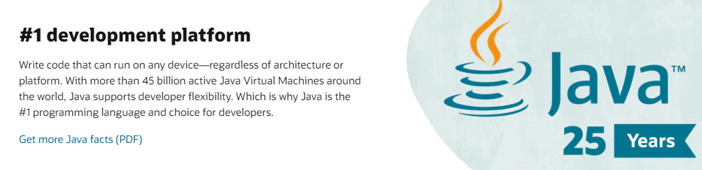

# C++无用论

在一些特定领域内，选择何种编程语言来完成工作是显而易见的。比如，嵌入式编程常用C或者汇编，FPGA/DSP编程常用VHDL。经过长时间的发展，这些领域形成了自己特定的开发工具链，很容易作为一种常识被接受和使用。

在开发运行在PC客户端或者服务器端的应用层程序时，情况却不太一样，通常有大量语言摆在面前，该选谁就不是随口能回答的问题了。不过，这种选择通常在Java/Python/JavaScript/C#等之间进行，C/C++作为“复杂”的语言，是最后的选择，总有办法拒绝或绕过它。C/C++在面向业务的系统开发中真的这么没有用吗？本节将从三个方面提出一些不同的看法，探讨更加客观理性的取舍问题。

## 时间和金钱

谈优劣不能抛开了场景。有说法认为，在线服务后台用C++写并没有优势。一个在线服务的端到端耗时分为两部分：服务端运算和网络传输。如果运算耗时在端到端耗时中占比很小，即使C++版本的实现比Python快十倍(分别为1ms和10ms)，并不能改变延迟高低由网络开销主导的事实。此时，用C++去追求足以被网络延迟掩盖的9ms的意义在哪呢？

这个挑战合乎逻辑。对于调用次数少、用户不多的程序，无论运行在客户端还是服务端，都没有必要为了降低一点点用户根本感知不到的时间选择一门开发难度更高的语言，用微不足道的资源浪费换取更好的开发体验是明智之举。不过换到有些场景下，这个逻辑并不成立。

有些服务对延迟极其敏感，大量用户竞速，以快取胜。如高频交易，毫秒的差距足以导致交易损失，使用C/C++甚至是汇编有时也不为过。这类服务对性能的追求没有止境。

今天的很多互联网服务拥有海量用户，动辄一个或多个机房的机器满负荷运行。运算时间每压缩一倍，就意味着QPS提升一倍，面对相同的流量就能节省50%的机器。快就意味着省钱，这和网络传输时间无关。

## 跨平台

平台间的可移植性是一个更难讨论清楚的问题。选择队伍需要的是经验、教训甚至是勇气，但不是贴在网站上的[标语](https://www.oracle.com/java/)。



提到跨平台语言，Java/C#/Python总是首先被想到，C++和跨平台是不沾边的。Java跨平台的能力取决于Oracle的Java虚拟机跨平台的能力：有多少平台上有Java虚拟机实现，Java代码就能跨多少平台。C++被认为不跨平台是因为它的可执行程序是平台相关的机器码。但是，一些C++代码可以做到同一份源码能被多数平台上的C++编译器编译。从源码层面看，C++是有一定的跨平台能力的。

那么，到底谁更优秀呢？场景说了算。如果想要程序能同时运行在Windows/Linux/Mac PC上，何不选择Java呢？如果还要能同时运行在Android/iOS上，Java仍然是一个有竞争力的选择。但是劣势已经开始显现，iOS的主流开发语言并不是Java。尽管由于Java的流行，iOS对它的支持一直在稳步推进，脱离主流选择Java还是难免招致一些不便。更重要的一点是，Java程序能不能在某个平台上运行取决于某个公司或组织，不以某个开发者的意志为转移。如果还想要程序在浏览器中运行呢？是时候忘掉Java了。

C++有时反而提供了某种优势。绝大多数平台或者设备一出现就会提供一个C++编译器，用来编译性能优化的Native程序。只要程序不涉及网络、UI等系统和硬件相关的资源，标准的C++代码还是很有可能被绝大多数平台支持的。具体来看，用C++实现跨平台的机器学习算法库是合理的，它的核心操作能够建立在通用的内存数据结构和算法之上。而用C++写一个跨平台的UI库，就不是非常明智的选择，这是在和平台主流生态做对抗。这方面有一个鲜活的例子。2019年，dropbox[宣布](https://dropbox.tech/mobile/the-not-so-hidden-cost-of-sharing-code-between-ios-and-android)他们即将抛弃在iOS和Android间共享一套C++代码的做法，宁愿用Swift和Kotlin写两遍代码。


## 抽象和性能

抽象分层是软件系统应对复杂问题的基本方法。例如，TCP/IP协议栈每层只专注部分功能，层层向上交付，最终实现数据的可靠传输。换到编程语言还是同样的思路，代码由高级语言经编译器转换为中间语言，再生成机器码。TCP/IP没有选择一层做完所有事情，开发人员也没有选择直接写出最终机器码，都是出于复杂度太高、扩展性太差的考虑。

在面对复杂问题时，抽象分层一开始就会被考虑。而面对历史遗留软件时，继续在外围封装新的一层而不是深入内部进行重构，也是经常被求稳的开发者采用的策略。不是只有小公司或者水平不佳的开发者才会这么做，大公司耳熟能详的产品很多也是一样的。这种懒惰的做法，尽管浪费一点，却提供了较好的兼容性和稳定性，综合代价是短期内最小的。

但是，不停地抽象、封装和分层在提升复用性和开发效率的同时，很可能会走入困境：每层都是最优解，组合起来却不是个全局最优解。换句话说，抽象封装和性能会相互制约。优秀的设计可以缓解冲突，但改变不了冲突的本质，更优的性能意味着抽象封装需要被打破。

```cpp
/* 已有高效实现的函数封装：*/
// split将字符转按空白字符切割为tokens
vector<string> split(string& str);
// count对vector元素个数进行计数
int count(vector<string>& vec);

/* Task：计算string的token个数 */
// 仅对token个数感兴趣，不需要切分结果时，组合以上函数并不是最高效的实现
vector<string> tokens = split(str);
int len = count(toekns);
```

具体到编程语言，更高级的语言通常做了更多的抽象封装，让人用起来更省心，这背后通常是拿了性能做交换。例如，Python的动态类型让Json这一数据结构表达起来特别舒服，但频繁的`box/unbox`也给它的运行速度提升设置了很大障碍，和“int就是干干净净4个字节”的C/C++比性能，还为时尚早。

随着设备的硬件配置越来越高，一些开发框架、SDK或最终产品也在抽象封装的路上越走越远，在资源利用方面却越来越不克制。面对耗费大量资源的抱怨时，它们会拿出一个无法反驳的聪明回答：机器的资源那么多，空着不用干嘛呢？充分利用资源换取开发效率不是最经济的做法吗？这种做法本来是没错的，但是它助长了开发者懒惰、贪婪的坏习惯，最终导致越来越多的资源怪兽出现。早晚有一天，当它们被用户集中安装在同一台设备上的时候，资源越来越紧张，运行越来越慢。硬件厂商为了扭转局面，便会生产出更加强大的硬件。于是，软件和硬件就在这种贪婪和弥补中交替向前。