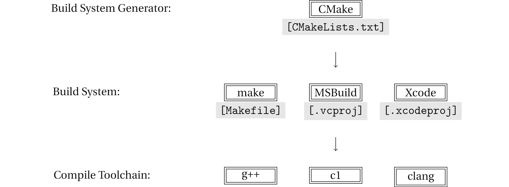
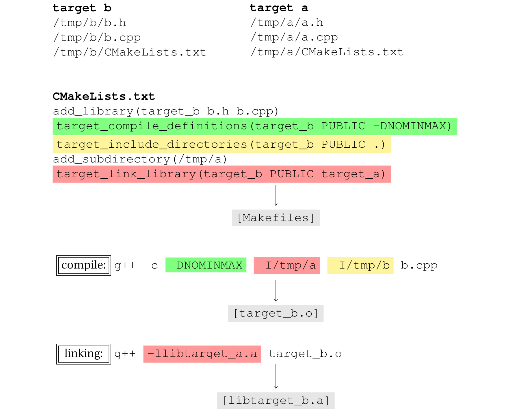

# CMake简介

构建可执行程序的核心操作是通过编译器命令行工具（g++等）完成的，但是直接使用它们构建包含大量源代码和依赖的项目还是太复杂了，我们需要更有条理的规范和更方便使用的工具。

在Linux的世界里，从源码编译和安装软件包是件很常见的事。这个过程中，有个[“三部曲”模式](https://thoughtbot.com/blog/the-magic-behind-configure-make-make-install)经常被采用：

```bash
./configure --prefix=/usr/local/bin/
make
make install
```

按照惯例，`configure`脚本负责查找系统本地的编译工具链，配置一些可定制的参数，例如指定安装目录，最终产出定制化的Makefile文件，供接下来的`make`和`make install`使用。

Kitware的开发人员将这一模式“发扬光大”，做了诸多增强和改进，在2000年前后发布了CMake这个跨平台的编译系统生成工具(Build System Generator)。Kitware目前仍负责维护CMake，代码本身采用社区开源模式管理，免费使用，Kitware提供商业的培训和技术支持。

相比IT产业技术更迭的速度，CMake已经算很古老的项目了。随之可以想象的是，它给人一种历史带来的晦涩感。但是一路走来，在C/C++编译方面，CMake做的尽管不是尽善尽美，却也还是最好的那个。喜欢还是不喜欢，它都已经成为一种事实标准，不仅绝大多数新的C++项目采用CMake编译，很多老项目也在逐步迁移到它上面来。

## 编译工具栈

编译C/C++，说到底，最终还是靠编译器程序外加一长串命令行配置项和开关完成的。根据平台和喜好，可选的编译工具链(Toolchain)有很多，例如：
* [GNU gcc/g++](https://gcc.gnu.org/)
* [MSVC](https://docs.microsoft.com/en-us/cpp/build/reference/compiling-a-c-cpp-program?view=vs-2019), Windows only
* [Clang](https://clang.llvm.org/get_started.html)

```bash
g++ main.cpp -I /path/to/include -L /path/tp/lib -l libbencoding -o foo.exe -std=c++11
```

但是，编译工作通常不是一行命令就能直接搞定的。前前后后难免有一些准备、清理工作和胶水逻辑，这时就需要一个好的构建系统(Build System)来管理整个构建流程。常用的构建系统有：
* [GNU Make](https://www.gnu.org/software/make/)
* [Ninja](https://ninja-build.org/)
* [MSBuild](https://docs.microsoft.com/en-us/visualstudio/msbuild/msbuild?view=vs-2019), with Microsoft Visual Studio
* [xcodebuild](https://developer.apple.com/library/archive/technotes/tn2339/_index.html), with Apple Xcode

有了构建系统，编译的流程就变成了提供对应构建系统的配置文件（IDE常称之为工程文件），如`Makefile`(GNU Make)、`.vcproj`(Visual Studio)或`.xcodeproj`(Xcode)，再调用编译系统的命令行间接完成编译。

```makefile
# A Sample Makefile
PROG=prog
CC=g++
CPPFLAGS=–I/home/tom/prog/include
LDFLAGS=-g -std=c++11 -Wall
OBJS=main.o
$(PROG) : $(OBJS)
    $(CC) $(LDFLAGS) -o $(PROG) $(OBJS)
main.o :
    $(CC) $(CPPFLAGS) -c main.cpp
clean:
    rm -f $(PROG) $(OBJS)
```

```bash
# GNU Make
make clean && make

# MSBuild
msbuild.exe projectname.proj /property:Configuration=Release

# xcodebuild
xcodebuild -scheme project_schema -project projectname.xcworkspace/ build
```

CMake这时的出现提供了又一层更高的抽象，它能以统一的语法生成不同构建系统需要的配置文件，因此，CMake被称为**Build System Generator**。这是个准确且重要的名字：它不是编译工具，也不是构建系统，而是一个**生成构建系统所需配置文件的工具**。CMake目前支持市面上几乎所有常用的，或基于命令行或基于IDE的构建系统。



## CMake Scripting Language

CMake拥有一套自己的脚本编程语言(DSL)。构建起始，它会默认寻找指定目录下一个叫做`CMakeLists.txt`的文件作为入口，该文件的内容就是构建脚本，被CMake加载、一步步解释执行。初学者可能对这个文件的心里预期是配置文件，这种偏差会阻碍对CMake的进一步理解。

CMake脚本语法是围绕着编译这个目标设计的，它支持变量、列表、函数调用、宏、分支条件判断、for循环和脚本文件的包含引用。

```cmake
cmake_minimum_required(VERSION 3.10 FATAL_ERROR)

# varibale
set(CMAKE_DEBUG_POSTFIX d)

# if condition
IF (${CMAKE_SYSTEM_NAME} MATCHES "Windows")
    set(CMAKE_WINDOWS_EXPORT_ALL_SYMBOLS TRUE)
ENDIF()

# function call
message("CMAKE_PREFIX_PATH=${CMAKE_PREFIX_PATH}")

# introduce other cmake script files
include(GNUInstallDirs)
include(CMakePackageConfigHelpers)
```

CMake的语法从很多方面看，都挺灾难的。首先，它的语法对大多数人来说是陌生的，开始一个新项目的方式往往只能是基于一个已有的模板进行修改。如果出现了某些不常见的需求，在`CMakelists.txt`里面对应要怎么写这件事往往全靠Google和StackOverflow，很让人头疼和尴尬。其次，CMake文档的写作风格继承了MSDN的精髓，长篇大论，例子稀少，很难耐心阅读下去。

## Modern CMake is Built on Targets

target是现代CMake的核心概念，一个target就是一个具体的编译目标，即一个静态库(lib)、动态库(so/dll)或可执行程序。每个target有自己的附属信息，包括头文件查找路径、链接的其它目标、编译参数和链接参数等。这些信息是通过一组以`target_`开头的命令指定的。

target和target之间的依赖则通过`target_link_libraries`命令定义，整个CMake工作流程的基础就是据此建立的target之间的依赖关系。这种方式和Package管理系统很类似，以Python为例，target就像pip包，target之间的依赖就像通过requirements.txt指定的pip依赖包列表，依赖关系构成了一个有向无环图。

```cmake
add_executable(hello helloworld.cpp)
target_compile_definitions(hello PUBLIC -DNOMINMAX -D_SCL_SECURE_NO_WARNINGS)
target_link_options(hello PUBLIC -Wl) 
target_include_directories(hello PUBLIC ${CMAKE_CURRENT_SOURCE_DIR})
target_link_libraries(hello PUBLIC protobuf::libprotoc)
```

## CMake工作流程

CMake的整个工作流程包含3个阶段：configure、generate和build。

在configure阶段，CMake会检测系统安装的C/C++编译器的信息，执行CMakeLists.txt中的脚本，分析其中的target依赖关系，最终将所有变量的值保存至CMakeCache.txt中供后续步骤使用。generate阶段会产出构建系统所需的配置（工程）文件，对于GNU make来说就是`Makefile`。这两步通常被一起执行：

```bash
$> cmake -S . -B build
-- The C compiler identification is GNU 4.8.4
-- The CXX compiler identification is GNU 4.8.4
-- Check for working C compiler: /usr/bin/cc
-- Check for working C compiler: /usr/bin/cc -- works
-- Detecting C compiler ABI info
-- Detecting C compiler ABI info - done
-- Detecting C compile features
-- Detecting C compile features - done
-- Check for working CXX compiler: /usr/bin/c++
-- Check for working CXX compiler: /usr/bin/c++ -- works
-- Detecting CXX compiler ABI info
-- Detecting CXX compiler ABI info - done
-- Detecting CXX compile features
-- Detecting CXX compile features - done
Processing CMakeLists.txt
-- Configuring done
-- Generating done
-- Build files have been written to: /.../build
```

到了build阶段，就完全是构建系统自己的事情了，CMake只需启动对应的构建系统开始构建即可。

```bash
$> cmake --build build
Scanning dependencies of target target_b
[ 50%] Building CXX object CMakeFiles/target_b.dir/b.cpp.o
[100%] Linking CXX library target_b
[100%] Built target target_b
```

下图展示了CMake工作流程的各个阶段，以及CMakeLists.txt中的语句如何影响最终的编译和链接行为。



## Multi-config和Single-config

构建系统分为两类，第一类是Visual Studio、Xcode和Ninja等，一个工程文件可以同时包含多套构建配置，如Debug/Release，这类构建系统称为是Multi-config的。另一类就是GNU make等，工程文件只能包含一套配置，称为Single-config。

工程文件是在generate阶段产生的，且不会再改变，这就导致在Multi-config和Single-config下，CMake有不同的使用方式。
* 对于Multi-config系统，generate阶段要决定产生**包含哪些配置**的工程文件。在build阶段，需要选择其中一种或多种进行构建。
* 对于Single-config系统，generate阶段要决定产生**哪一种配置**的工程文件。在build阶段，无需再选择，因为没有选择。

```bash
# Multi-config
cmake -S . -B build -DCMAKE_CONFIGURATION_TYPES="Debug;Release" -G "Visual Studio 16 2019" -A x64
cmake --build build --config Release

# Single-config
cmake -S . -B build -DCMAKE_BUILD_TYPE=Release
cmake --build build
```

## Generator Expression

[generator expression](https://cmake.org/cmake/help/latest/manual/cmake-generator-expressions.7.html)是一个晦涩难懂，却又得经常使用的特性。

关于generator expression，首先要解答的问题是它为什么存在，它能做什么，没它不行吗？让我们跟随一个具体需求一步步走走看：在编译目标文件产生之后，把它们拷贝到自定义目标路径中去。如果是Debug build，目标路径为安装路径下的debug子目录，如果不是Debug build，直接拷贝到安装路径。

```cmake
if (CMAKE_BUILD_TYPE EQUAL "Debug")
    add_custom_command(
    TARGET target_b POST_BUILD
    COMMAND ${CMAKE_COMMAND} -E copy_directory
            ${CMAKE_CURRENT_BINARY_DIR}
            ${CMAKE_INSTALL_PREFIX}/target_b/debug)
else ()
    add_custom_command(
    TARGET target_b POST_BUILD
    COMMAND ${CMAKE_COMMAND} -E copy_directory
            ${CMAKE_CURRENT_BINARY_DIR}
            ${CMAKE_INSTALL_PREFIX}/target_b)
endif ()
```

对于Single-config的GNU makefile，以上做法没任何问题，完全能够达到目的。除此之外，问题有二。

第一，太啰嗦，重复了两遍类似的代码。

第二，对于Multi-config的Visual Studio，达不到想要的目的。CMakeLists.txt文件早在configure阶段就已经被解释执行了，而Debug/Release是直到generate阶段产生工程文件时才能确定下来的。因此，CMAKE_BUILD_TYPE这个变量对Multi-config构建系统无效。

generator expression可以同时解决以上两个问题。`$<$<CONFIG:Debug>:debug>`在Debug build时evaluate为debug，否则为空。这个实现还同时支持Single-config和Multi-config构建系统。
```cmake
add_custom_command(
    TARGET target_b POST_BUILD
    COMMAND ${CMAKE_COMMAND} -E copy_directory
            $<TARGET_FILE_DIR:target_b>
            ${CMAKE_INSTALL_PREFIX}/target_b/$<$<CONFIG:Debug>:debug>)
```

对比以上两种写法，generator expression提供的价值总结为两点。

第一，将分支判断表达式直接写在需要其执行结果的地方，消除一些冗余代码。这点上很类似Python最新的字符串格式化语法。

```py
greeting = f'Hi {"Mr." if gender == "male" else "Mrs."} {name}'
```

第二，提供了延迟求值功能。在configure阶段，表达式不会被求值，而是推迟到后续有更多信息的generate阶段。

generator expression可做的事情还有很多，其中比较常用的另一例是，方便地实现conditional include或linking。至于generator expression的语法规则及功能列表，非本节之志向，还请移步[generator expression文档](https://cmake.org/cmake/help/latest/manual/cmake-generator-expressions.7.html)。

```cmake
# RapidJSON_INCLUDE_DIR仅在源码编译时需要被查找
# include目录仅在作为package安装后，被find_pacakge()导入时需要被查找
target_include_directories(target_b 
    PUBLIC
        $<BUILD_INTERFACE:${RapidJSON_INCLUDE_DIR}>
        $<INSTALL_INTERFACE:include>)
```

## PUBLIC PRIVATE INTERFACE

If you are creating a shared library and your source cpp files #include the headers of another library (Say, QtNetwork for example), but your header files don't include QtNetwork headers, then QtNetwork is a PRIVATE dependency.

If your source files and your headers include the headers of another library, then it is a PUBLIC dependency.

If your header files but not your source files include the headers of another library, then it is an INTERFACE dependency.

Other build properties of PUBLIC and INTERFACE dependencies are propagated to consuming libraries. http://www.cmake.org/cmake/help/v3.0/manual/cmake-buildsystem.7.html#transitive-usage-requirements

## Resources

**1.** [It's Time To Do CMake Right](https://pabloariasal.github.io/2018/02/19/its-time-to-do-cmake-right/)

**2.** Best video: [Effective cmake](https://youtu.be/rLopVhns4Zs)

Variables are so CMake 2.8.12. But modern CMake is all about Targets and Properties.

Imagine targets as objects. Declare direct dependencies with target_link_libraries.

CMake is not a build system. It is build system generator for make, ninja or visual studio.

**3.** [Using Modern CMake Patterns to Enforce a Good Modular Design](https://youtu.be/eC9-iRN2b04)


**4.** [Create relocatable package with proper autogenerated config cmake
](https://stackoverflow.com/questions/45730997/create-relocatable-package-with-proper-autogenerated-config-cmake)

**5.** [CMakePackageConfigHelpers](https://cmake.org/cmake/help/v3.14/module/CMakePackageConfigHelpers.html)

**6.** [Create dlls on Windows without declspec() using new CMake export all feature](https://blog.kitware.com/create-dlls-on-windows-without-declspec-using-new-cmake-export-all-feature/)

## 练习

**1.** 使用Make分别编译Debug和Release版本。

**2.** 使用CMake为一个Multi-config构建系统生成工程，根据当前配置是Debug还是Release，将编译输出拷贝到不同的目标路径下。

**3.** 某代码在编译阶段需要读取一个系统环境变量，例如BOOST_ROOT。能在`CMakeLists.txt`里面设置该变量吗？为什么？

**4.** 如何定位编译过中错误的原因？

`SET(CMAKE_VERBOSE_MAKEFILE ON CACHE BOOL "Makefile log verbose")` and look into the gcc/ld command line.
