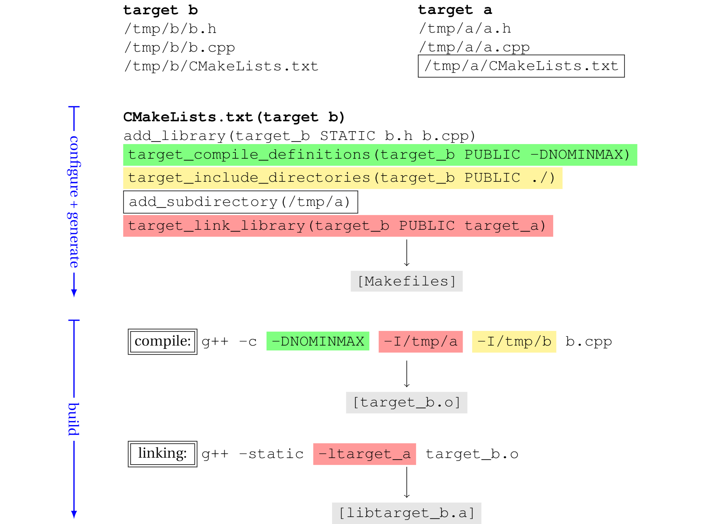

# CMake简介

在Linux的世界里，从源码编译、安装工具包是件很常见的事情。这个过程中，有个[“三部曲”模式](https://thoughtbot.com/blog/the-magic-behind-configure-make-make-install)经常被采用：

```bash
./configure --prefix=/usr/local/bin/
make
make install
```

按照惯例，`configure`脚本负责查找系统本地的编译工具链，配置一些可定制的参数，例如指定安装目录，最终产出定制化的Makefile文件，供接下来的`make`和`make install`使用。

Kitware的开发人员将这一模式“发扬光大”，做了诸多增强和改进，在2000年前后发布了CMake这个跨平台的编译系统生成工具(Build System Generator)。Kitware目前仍负责维护CMake，代码本身采用社区开源模式管理，免费使用，Kitware提供商业的培训和技术支持。

相比IT产业技术更迭的速度，CMake已经算很古老的项目了。随之可以想象的是，它给人一种历史带来的晦涩感。但是一路走来，在C/C++编译方面，CMake做的尽管不是尽善尽美，却也还是最好的那个。喜欢还是不喜欢，它都已经成为一种事实标准，不仅绝大多数新的C++项目采用CMake编译，很多老项目也在逐步迁移到它上面来。

## 编译工具栈

编译C/C++，说到底，最终还是靠编译器程序外加一长串命令行配置项和开关完成的。根据平台和喜好，可选的编译工具链(Toolchain)有很多，例如：
* [GNU gcc/g++](https://gcc.gnu.org/)
* [MSVC](https://docs.microsoft.com/en-us/cpp/build/reference/compiling-a-c-cpp-program?view=vs-2019), Windows only
* [Clang](https://clang.llvm.org/get_started.html)

```bash
g++ main.cpp -I /path/to/include -L /path/tp/lib -l libbencoding -o foo.exe -std=c++11
```

但是，编译工作通常不是一行命令就能直接搞定的。前前后后难免有一些准备、清理工作和胶水逻辑，这时就需要一个好的构建系统(Build System)来管理整个构建流程。常用的构建系统有：
* [GNU Make](https://www.gnu.org/software/make/)
* [Ninja](https://ninja-build.org/)
* [MSBuild](https://docs.microsoft.com/en-us/visualstudio/msbuild/msbuild?view=vs-2019), with Microsoft Visual Studio
* [xcodebuild](https://developer.apple.com/library/archive/technotes/tn2339/_index.html), with Apple Xcode

有了构建系统，编译的流程就变成了提供对应构建系统的配置文件，例如Makefile(GNU Make)、vcproj(Visual Studio)或xcodeproj(Xcode)，再调用编译系统提供的命令，如`make clean; make`等间接完成编译。

```makefile
PROG=prog
CC=g++
CPPFLAGS=–I/home/tom/prog/include
LDFLAGS=-g -std=c++11 -Wall
OBJS=main.o
$(PROG) : $(OBJS)
    $(CC) $(LDFLAGS) -o $(PROG) $(OBJS)
main.o :
    $(CC) $(CPPFLAGS) -c main.cpp
clean:
    rm -f $(PROG) $(OBJS)
```

CMake这时的出现提供了又一层更高的抽象，它能以统一的语法生成不同构建系统需要的配置文件，因此，CMake被称为**Build System Generator**。这是个准确且重要的名字：它不是编译工具，也不是构建系统，而是一个**生成构建系统所需流程的工具**。CMake目前支持几乎市面上所有无论是基于命令行还是IDE的构建系统。


## CMake Scripting Language

CMake发明了一套自己的脚本编程语言。构建开的时候，它会默认寻找当前目录下一个叫做`CMakeLists.txt`的文件作为入口，这个文件里面保存的就是构建脚本。CMake初学者可能对这个文件的心里预期是配置文件，这种理解会阻碍对CMake的进一步学习，是纠正观念的时候了：`CMakeLists.txt`是脚本文件，被CMake加载、一步一步解释执行。

CMake的脚本语法是围绕着编译这个目标设计的。支持变量、函数调用、宏、分支条件判断、for循环和脚本文件的包含引用。

```cmake
cmake_minimum_required(VERSION 3.10 FATAL_ERROR)

# varibale
set(CMAKE_DEBUG_POSTFIX d)

# if condition
IF (${CMAKE_SYSTEM_NAME} MATCHES "Windows")
    set(CMAKE_WINDOWS_EXPORT_ALL_SYMBOLS TRUE)
ENDIF()

# function call
message("CMAKE_PREFIX_PATH=${CMAKE_PREFIX_PATH}")

# introduce another cmake script file
include(GNUInstallDirs)
include(CMakePackageConfigHelpers)
```

CMake的功能集合对于使用者来说，在很多方面都挺灾难的。首先，它的语法对大多数人来说都是陌生的，开始一个新项目的方式往往是基于一个已有的模板进行修改。如果有某些不常见的需求，在`CMakelists.txt`里面对应要怎么写这件事全靠StackOverflow。这个启动的成本很让人头疼和尴尬。

其次，CMake文档的写作风格继承了MSDN的精髓，大多没有例子，内容是标题的重复，“详实而看不懂”，让人很沮丧。


## Modern CMake is Built on Targets

现代CMake是构建在target和target之间的相互依赖上的。核心概念target指的就是一个具体的编译目标，即一个静态库(lib)、动态库(so/dll)或可执行程序。

每个target都有自己的附属信息，包括头文件查找路径、链接的其它目标、编译参数和链接参数等。这些信息是通过一组以`target_`开头的命令指定的。target和target之间的依赖通过`target_link_libraries`命令定义。

```cmake
add_executable(hello helloworld.cpp)
target_compile_definitions(hello PUBLIC -DNOMINMAX -D_SCL_SECURE_NO_WARNINGS)
target_link_options(hello PUBLIC -Wl) 
target_include_directories(hello PUBLIC ${CMAKE_CURRENT_SOURCE_DIR})
target_link_libraries(hello PUBLIC protobuf::libprotoc)
```


