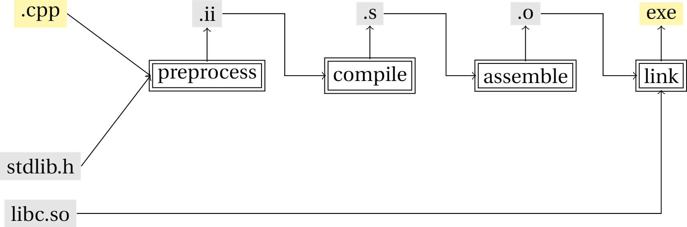

# 从源代码到可执行程序

很多人的C++之旅或许是从hello world程序和IDE开始的。通过点击CLion或者Visual Studio的一些按钮很快能在屏幕打印出“hello world”字样。实际上，在背后，IDE需要调用具体的编译器命令行程序，在Linux上，可能是g++，在Windows上是Visual Studio提供的c1。

```cpp
#include <iostream>
using namespace std;

int main()
{
    cout << "hello world" << endl;
    return 0;
}
```

```bash
# gnu toolchain
g++ -c hello_world.cpp

# visual studio toolchain
cl /EHsc hello_world.cpp
```

虽然以上命令一次性就产出了最终的可执行文件，实际上内部涉及了四个处理步骤：预处理、 编译、汇编和链接。g++/c1通过依次调用一组独立的工具来输出最终结果。前三步中，编译器是对每个源文件(.cpp/.cc)独立进行的，每一个源文件就是一个处理单元。最后一步，链接器会统筹所有目标文件，解决跨源文件的符号依赖。

拆解这些步骤有利于理解编译过程中可能面临的错误，也有利于写出更加高效的C和C++代码。



## 预处理(Preprocess)

编译源文件之前的一步是调用预处理器(cpp)对源文件进行预处理，生成一个[预编译之后的中间文件](hello_world.i)。预处理这一步可以被看作是对源代码文件所作的一次字符串替换。具体的操作包括以下三类。

* 递归读取`#include`头文件并替换到源文件中。
* 宏定义替换。
* 条件编译指令。

```cpp
// hello_world.cpp

#include <stdio.h>

#define SUM(a,b) (a+b)

int sum(int a, int b) {
    return a + b;
}

int main(int argc, char* argv[]) {
    int res = sum(1, 2);
    printf("%d", res);
    res = SUM(1, 2);
    return 0;
}
```


```bash
cpp hello_world.cpp hello_world.ii
# or
g++ -E hello_world.cpp > hello_world.ii
```

```cpp
// hello_world.ii

# 1 "hello_world.cpp"
# 1 "<built-in>"
# 1 "<command-line>"
# 1 "/usr/include/stdc-predef.h" 1 3 4

...

namespace std
{
  typedef long unsigned int size_t;
  typedef long int ptrdiff_t;
  typedef decltype(nullptr) nullptr_t;

}

...

# 3 "hello_world.cpp"
int sum(int a, int b){
    return a + b;
}

int main(int argc, char* argv[]) {
    int res = sum(1, 2);
    printf("%d", res);
    res = (1 +2); // macro definition is repalced
    return 0;
}

```

## 编译(Compile)

接下来，编译器cc1plus将中间文件`hello_world.i`编译成汇编代码[hello_world.s](hello_world.s)。这一步是真正的词法、语法分析等发生的地方。

```bash
/usr/lib/gcc/x86_64-linux-gnu/7/cc1plus hello_world.ii -Og -o hello_world.s
# or
g++ -S hello_world.cpp
```

## 汇编(Assemble)

```bash
as -o hello_world.o hello_world.s
# or
g++ -c hello_world.cpp
```

## 链接(Link)

链接器需要解决printf等没有定义在`hello_world.o`中的外部符号，这些符号定义在预先编译好的C兼容库中，一般随着编译器一起被安装，通过命令行参数`-lc`引入。缺少这个链接库，便会导致一个链接错误。

```bash
/usr/lib/gcc/x86_64-linux-gnu/7/collect2 \
    -dynamic-linker /lib64/ld-linux-x86-64.so.2 \
    -o hello_world \
    /usr/lib/gcc/x86_64-linux-gnu/7/../../../x86_64-linux-gnu/Scrt1.o \
    /usr/lib/gcc/x86_64-linux-gnu/7/../../../x86_64-linux-gnu/crti.o \
    /usr/lib/gcc/x86_64-linux-gnu/7/crtbeginS.o \
    -L/usr/lib/gcc/x86_64-linux-gnu/7 \
    -L/usr/lib/gcc/x86_64-linux-gnu/7/../../../x86_64-linux-gnu \
    -L/usr/lib/gcc/x86_64-linux-gnu/7/../../../../lib \
    -L/lib/x86_64-linux-gnu \
    -L/lib/../lib \
    -L/usr/lib/x86_64-linux-gnu \
    -L/usr/lib/../lib -L/usr/lib/gcc/x86_64-linux-gnu/7/../../.. \
    hello_world.o \
    -lstdc++ -lm -lgcc_s -lgcc -lc -lgcc_s -lgcc \
    /usr/lib/gcc/x86_64-linux-gnu/7/crtendS.o \
    /usr/lib/gcc/x86_64-linux-gnu/7/../../../x86_64-linux-gnu/crtn.o
# or
g++ -v -o hello_world hello_world.o
```

```bash
# remove -lc will result in a linking error. 
/usr/bin/ld: hello_world.o: undefined reference to symbol 'printf@@GLIBC_2.2.5'
```