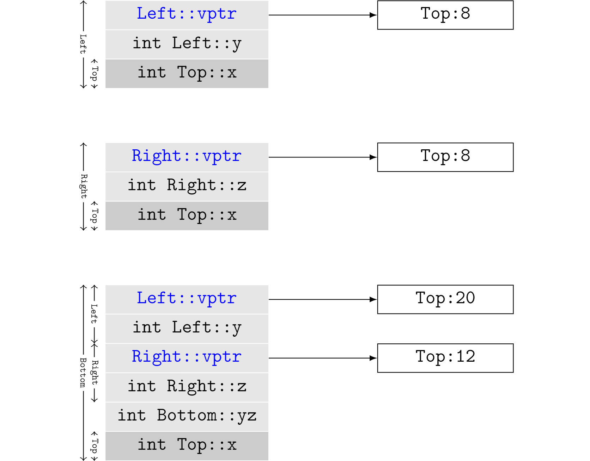

# 继承与对象模型

## 单一继承的数据布局

在单一继承场景下，C++标准只要求派生类中基类部分(subobject)必须和单独的基类对象保持一致的内存布局。

这样规定的好处或者原因是什么呢？答案是，基类和派生类对象之间的转换和互操作性。派生类本身是对基类的扩展，应该可以通过派生类访问属于基类的成员函数。而在调用基类的函数时，这些函数不可能知道操作的对象是一个单独的基类对象，还是隶属于某个派生类对象的一部分。因此，两种情况下，基类的内存布局必须保持一致。

```cpp
class A
{
public:
    void print_a();
private:
    char x;
}

class B: public A
{
public:
    void print_b();
private:
    char y;
};
```

```cpp

```

出于内存访问效率的考虑，编译器倾向于让每个对象都开始于某个字节数（例如，4字节或者8字节）的整数倍上，称为padding。“继承与否，内存布局一致”，在一定程度上会导致对象占用的内存有所膨胀。

假设编译器采用4字节padding，A由于只有一个char类型member，会被补齐3个字节，最终A类型对象的size为4。B继承自A，添加了一个char类型的y，但y不可以紧邻着x放置，因为这破坏了标准规定的原则。最终B再次被padding，size为8。而B如果没有继承自A，x，y都定义在B中，B的size则是4。

文初的要求还可以衍生出以下解读：基类部分在派生类中的位置是自由的。但是，一般编译器会把基类部分放在头部。这体现了C++标准和编译器实现之间常有的一种默契：标准之外虽然有一些自由，但是选择有优劣之分，编译器最终大多会统一到一种共识上去。


## 多继承的数据布局

如果编译器选择将基类部分至于派生类开头，单一继承情况下，基类和派生类之间的转换是非常自然的：它们都开始于同一个内存位置，差别只在于派生类要容纳自己多出来的部分，要更大一些。而多继承的时候，情况就完全不同了，问题要复杂得多。

多继承带来的第一个麻烦是，编译器需要根据情况，适当调整this指针的位置。

```cpp
class Left
{
public:
    void print_left();
private:
    int y;
}

class Right
{
public:
    void print_right();
private:
    int z;
};

class Bottom: public Left, public Right
{
public:
    void print_bottom();
private:
    int yz;
};
```

C++标准并未规定，Left和Right在Bottom的内存布局中的先后次序，这里假设按照继承申明次序，Left在前Right在后。在Bottom类型的对象上调用Right类的函数时，编译器就要适当调整this指针的位置。好在这一切可以在编译期间确定，不会产生额外的开销。

```cpp
Bottom* bottom = new Bottom();
bottom->print_bottom();

// without shift, wrong Bottom.
Bottom_print_bottom(bottom);

// compiler shift pointer ab with an offset.
Bottom_print_bottom(bottom + sizeof(Left));
```

多继承带来的另外一个麻烦之处是，菱形继承。如果在继承路径上同一个基类被继承多次，则需要去重，将它们合并为一个。C++解决这个问题的方案是虚继承（Virtual Inheritance）。

```cpp
class Top
{
public:
    void print_top();
private:
    char x;
}

class Left: public virtual Top
{
public:
    void print_left();
private:
    char y;
};

class Right: public virtual Top
{
public:
    void print_right();
private:
    char z;
};

class Bottom: public Left, public Right
{
public:
    void print_bottom();
private:
    char yz;
};
```

虚继承随之带来了另一个问题，继承链条上的每个类型的内存排布都可能不同。也就是说，Bottom中Top的偏移位置和Left或Right中Top的偏移位置都不相同。编译器为了解决这个问题，需要实现[虚基类表(Virtual Base Classes Table)](MemoryLayoutMultipleInheritance.pdf)，用以记录每个虚基类的绝对位置或距离对象起始位置的offset。

如果Left是一个独立的对象，访问基类Top的成员时，this指针需要偏移8字节（32位机器，4字节对齐）。而如果Left是从Bottom类型的对象中得来的subobject，访问Top类型成员时，this指针则需要偏移20个字节。



C++是为数不多有胆量全面支持多继承的语言。实际上，如果让C++再选一次，多继承要不要加进标准是值得商榷的，而不是被理所当然地接受。多继承带来了指针访问开销，以及太多额外复杂性，以至于盖过了它所带来的收益，更为明智的选择显然是通过合理调整继承结构，避免多继承的出现。Java/C#等后来语言也都选择不支持多继承，转而代以接口(Interface)这个概念。

## 练习

**1.** 多继承时，类对象中的所有subobject可以共享一个虚基类表吗？

**2.** 当类的继承关系比较复杂时，很难人工判断是否会出现菱形继承。一种解决办法是，继承时总是使用virtual关键字。这样做可行吗？如果可行，有没有坏处？

**3.** 提出一种新的解决多继承问题的方案。
