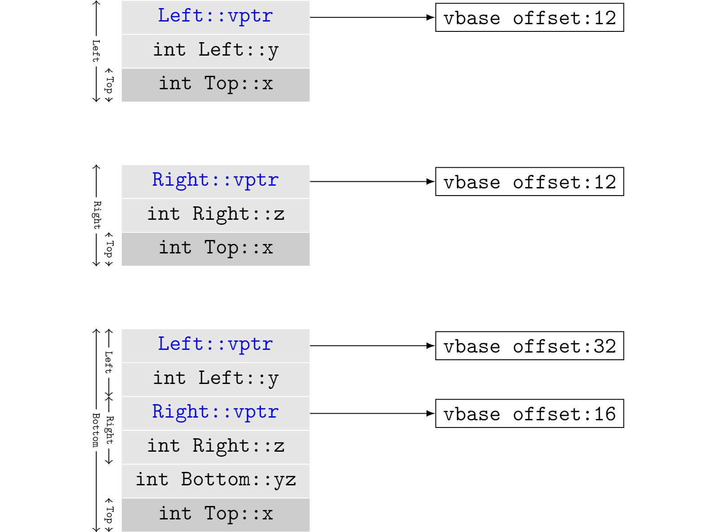

# 继承与对象模型

## 单一继承的对象布局

在单一继承场景下，C++标准只要求派生类中基类部分(subobject)必须和单独的基类对象保持一致的内存布局。

```cpp
class A
{
public:
    void print_a();
private:
    char x;
}

class B: public A
{
public:
    void print_b();
private:
    char y;
};
```

这样规定的好处或者原因是什么呢？答案是，基类和派生类对象之间的转换和互操作性。派生类本身是对基类的扩展，应该可以通过派生类访问属于基类的成员函数。而在调用基类的函数时，这些函数不知道操作的对象是一个单独的基类对象，还是隶属于某个派生类对象的一部分。因此，两种情况下，基类的内存布局需要保持一致。

这一规定还可以衍生出以下解读：基类部分在派生类中的位置是自由的。编译器可以把基类部分放在头部，也可以放在尾部。这是标准和实现之间的默契：标准之外有一些自由供编译器自行选择。


## 多继承的对象布局

单一继承情况下，如果编译器选择将基类部分置于派生类起始位置，基类和派生类之间的转换是非常自然的：它们都开始于同一个内存位置，差别只在于派生类要容纳自己多出来的部分，要更大一些。而多继承的时候，情况就完全不同了，问题要复杂得多。

多继承带来的第一个麻烦是，编译器需要根据情况，适当调整this指针的位置。

```cpp
class Left
{
public:
    void print_left();
private:
    int y;
}

class Right
{
public:
    void print_right();
private:
    int z;
};

class Bottom: public Left, public Right
{
public:
    void print_bottom();
private:
    int yz;
};
```

C++标准并未规定，Left和Right在Bottom的内存布局中的先后次序，这里假设按照继承申明次序，Left在前Right在后。在Bottom类型的对象上调用Right类的函数时，编译器就要适当调整this指针的位置。好在这一切可以在编译期间确定，不会产生额外的运行时开销。

```cpp
Bottom* bottom = new Bottom();
bottom->print_bottom();

// without shift, wrong Bottom.
Bottom_print_bottom(bottom);

// compiler shift pointer ab with an offset.
Bottom_print_bottom(bottom + sizeof(Left));
```

多继承带来的另外一个麻烦是菱形继承。如果在继承路径上同一个基类被继承多次，需要进行去重，将它们合并为一个。C++解决这个问题的方案是虚继承(Virtual Inheritance)。

```cpp
class Top
{
public:
    void print_top();
private:
    int x;
};

class Left: public virtual Top
{
public:
    void print_left();
private:
    int y;
};

class Right: public virtual Top
{
public:
    void print_right();
private:
    int z;
};

class Bottom: public Left, public Right
{
public:
    void print_bottom();
private:
    int yz;
};
```

虚继承带来的问题是继承链条上的每个类型的内存排布都可能不同。也就是说，Bottom中Top的偏移位置和Left或Right中Top的偏移位置并不一样，给调用不同类型的接口函数时计算this指针的偏移带来了困难。

编译器为了解决该问题，引入了[Virtual Table](MemoryLayoutMultipleInheritance.pdf)，用来定位每个虚基类距离起始位置的偏移量，通常这个字段被命名为`Virtual Base Offset`。虚继承是激活编译产生Virtual Table的场景之一，另一个场景是类中定义了虚函数，这是下一节的主题。

clang打印的类内存布局如下，由于对齐的原因，Bottom中存在一些Padding。

```bash
$ clang -cc1 -fdump-record-layouts obj_model_inherit.cpp

*** Dumping AST Record Layout
         0 | class Top
         0 |   int x
           | [sizeof=4, dsize=4, align=4,
           |  nvsize=4, nvalign=4]

*** Dumping AST Record Layout
         0 | class Left
         0 |   (Left vtable pointer)
         8 |   int y
        12 |   class Top (virtual base)
        12 |     int x
           | [sizeof=16, dsize=16, align=8,
           |  nvsize=12, nvalign=8]

*** Dumping AST Record Layout
         0 | class Right
         0 |   (Right vtable pointer)
         8 |   int z
        12 |   class Top (virtual base)
        12 |     int x
           | [sizeof=16, dsize=16, align=8,
           |  nvsize=12, nvalign=8]

*** Dumping AST Record Layout
         0 | class Bottom
         0 |   class Left (primary base)
         0 |     (Left vtable pointer)
         8 |     int y
        16 |   class Right (base)
        16 |     (Right vtable pointer)
        24 |     int z
        28 |   int yz
        32 |   class Top (virtual base)
        32 |     int x
           | [sizeof=40, dsize=36, align=8,
           |  nvsize=32, nvalign=8]
```

如果Left是一个独立的对象，访问基类Top的成员时，this指针需要偏移12字节(8字节vptr+4字节int y)。而如果Left是从Bottom类型的对象中得来的Sub-Object，访问Top类型成员时，this指针则需要偏移32个字节。



C++是为数不多有勇气支持多继承的语言。如果让C++再选一次，多继承要不要加进标准恐怕是值得商榷的。多继承带来了开销和太多额外复杂性，以至于盖过了它所带来的收益。更为明智的选择是通过合理调整继承结构，避免多继承的出现。Java/C#等后来语言也都选择不支持多继承，转而代以接口(Interface)这个概念。

## 练习

**1.** 多继承时，类实例中的所有Subobjects可以共享一个虚表吗？

**2.** 同一个类的所有实例可以共享同一个虚表吗？多继承时呢？

**3.** 当类的继承关系比较复杂时，很难人工判断是否会出现菱形继承。一种解决办法是，继承时总是使用virtual关键字。这样做可行吗？如果可行，有没有坏处？

**4.** 提出一种新的解决多继承问题的方案。
