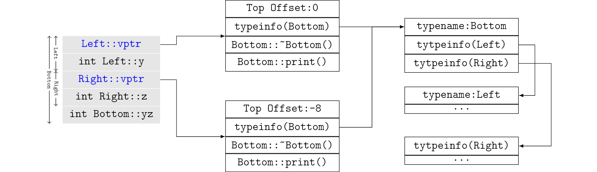

# 多态与对象模型

## 单一继承的对象布局

当类中定义了虚函数或者继承了定义虚函数的基类时，类的对象布局中会产生一个虚函数指针，指向该类型的虚表(Virutal Table)。

有的编译器将虚表放在对象头部，有的放在尾部。放在头部的好处是，无需任何偏移就可以访问虚表，对象的起始位置在偏移一个指针的位置，计算起来都比较方便。放在尾部的好处是，对象指针指向的的内存地址就是对象的起始位置，保持了和C语言的兼容性。为了维持着这一原则，没有虚函数的C++ struct是没有虚表的。

## 多继承的对象布局

```cpp
class Left
{
public:
    virtual void print();
private:
    int y;
};

class Right
{
public:
    virtual void print();
private:
    int z;
};

class Bottom: public Left, public Right
{
public:
    void print();
private:
    int yz;
};
```

clang打印出的类内存布局信息如下：

```bash
$ clang -cc1 -fdump-record-layouts obj_model_poly.cpp

*** Dumping AST Record Layout
         0 | class Left
         0 |   (Left vtable pointer)       
         8 |   int y
           | [sizeof=16, dsize=12, align=8,
           |  nvsize=12, nvalign=8]        

*** Dumping AST Record Layout
         0 | class Right
         0 |   (Right vtable pointer)      
         8 |   int z
           | [sizeof=16, dsize=12, align=8,
           |  nvsize=12, nvalign=8]

*** Dumping AST Record Layout
         0 | class Bottom
         0 |   class Left (primary base)
         0 |     (Left vtable pointer)
         8 |     int y
        16 |   class Right (base)
        16 |     (Right vtable pointer)
        24 |     int z
        28 |   int yz
           | [sizeof=32, dsize=32, align=8,
           |  nvsize=32, nvalign=8]
```



在把派生类指针赋给基类指针时，编译器会安插代码进行偏移量调整，使基类指针指向正确的基类子对象起始位置，这一步是在编译时发生的。例如，当基类指针`Left* left`被派生类指针`new Bottom()`赋值时，`left`指针无需被调整(偏移量为0)，而`right=new Bottom()`被初始化时，会被加上一个16字节的偏移量。

根据虚表调用虚函数`print()`时，调用的是`Bottom`类的接口函数，需要把this指针调整到Bottom类的起始位置，调整的值就是虚表中的`Top Offset`，这一步是在运行时发生的。如果是通过`left`指针调用的，不需要调整，如果是`right`，则要将`right`减去16字节得到`Bottom`对象的起始位置。

```cpp
Left* left = new Bottom(); // left += 0 (at compilation)
left->print();  // this += 0 (at runtime)

Right* right = new Bottom();  // right += 16 (at compilation)
right->print();  // this -= 16 (at runtime)
```

不同编译器对虚函数的实现可能有所不同，了解现实中MSVC编译器的实现，可以参考[Reversing Microsoft Visual C++ Part II: Classes, Methods and RTTI](http://www.openrce.org/articles/full_view/23)。

## 练习

**1.** 虚继承和虚函数都会导致Virtual Table的产生，为什么它们需要的信息可以复用同一张Virtual Table来存储？

**2.** 多继承时，类实例中的所有Subobjects可以共享一个虚表吗？

**3.** 同一个类的所有实例可以共享同一个虚表吗？多继承时呢？

**4.** 析构函数为什么需要申明为virtual？

**5.** 什么情况下C++的类和C的struct是兼容的？

**6.** 提出一种新的解决虚函数调用的方案。
