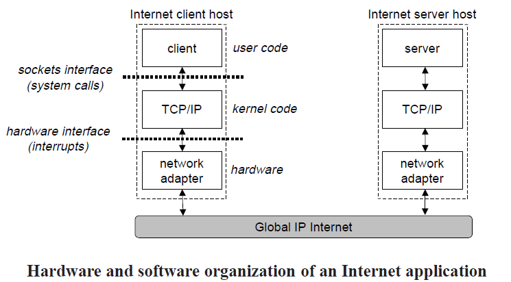
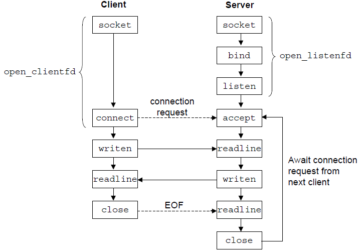

# 异步IO

由于磁盘、网卡等输入输出设备和CPU的处理速度不匹配，异步是程序处理输入输出的常用模式。用户线程发起IO任务后并不等待任务完成，而是直接返回继续其它工作，系统在任务完成之后通过回调函数等机制通知发起线程任务完成。IO编程模式如何从阻塞/非阻塞、多路复用演进到异步，而后又到协程，是本节的路线。

常见的IO操作有两类：磁盘和网络IO。基于Linux一切都是文件的哲学，多数处理IO的系统调用都能兼顾磁盘文件和网络设备读写。不过，存取磁盘数据和处理网络请求毕竟是不同的，内核(尤其是Linux)对它们的抽象封装还在改进当中，相应的编程模式还是有所区别。本节开头将忽略这种区别，主要以高并发服务关注的网络IO为例。

## Socket网络编程

在计算机网络中，使用最为广泛的通信协议是TCP/IP协议簇。进程间通信采用的是客户端/服务器模型，运行在客户端和服务器端主机应用层的程序通过建立点对点的连接来实现通信，连接的端点称为[socket](http://en.wikipedia.org/wiki/Network_socket)，它由网络层的IP地址和传输层的TCP(UDP)端口组成。一个连接由通信两端的socket对唯一确定，这对socket称为套接字对，由一个二元组表示。服务器和客户端通过对各自socket的读写实现数据的收发。

```
(ClientAddr:ClientPort, ServerAddr:ServerPort)
```
    


操作socket的一组最有名的API是[Berkeley Socket APIs](http://en.wikipedia.org/wiki/Berkeley_sockets#Socket_API_functions)。它最早于1983年在BSD Unix 4.2上发布。然而，由于AT&T的专利保护着UNIX，到1989年Berkeley大学才能够自由地发布它们。其设计简单、实用，后来逐渐成为了网络socket操作的事实标准。包含的主要函数有：

* socket()
* bind()/listen()/accept(). Used on the server side.
* connect(). Used on the client side.
* send()/recv(), or write()/read(), or sendto()/recvfrom()
* close()
* select(), poll()

## 阻塞和非阻塞IO

基于BSD Socket APIs，client和server的交互流程如下图。在服务器端，完成一次通信需要五步：

1. 建立监听socket listen_fd。
2. 通过bind将listen_fd绑定到端口上。
3. 开始在listen_fd上进行监听。
4. 一旦有client连接，listen操作就会返回。此时调用accept操作返回一个新的socket conn_fd。
5. 通过对conn_fd的read和write调用从client收发数据。



`read`和`write`等socket IO操作，有两种工作模式：阻塞(Blocking)和非阻塞(Non-blocking)。

```cpp
const int bytes_to_read = 128;
char buffer[bytes_to_read];
int n = 0;
while(n < bytes_to_read) {
    n += read(conn_fd, buffer + n, bytes_to_read - n);
}
```

用户线程执行阻塞IO调用时，会阻塞在调用处，直到有数据就绪或出错内核才会重新唤醒线程继续往下执行。阻塞IO调用返回，一定有数据已经被处理了。

用户线程执行非阻塞IO调用时，如果内核发现数据没有就绪，不会直接阻塞用户线程，而是直接返回EAGAIN，通知用户线程下次再试。非阻塞IO调用返回，不一定有数据被处理。这种模式下，用户线程要不停地循环调用尝试读写数据，直到所有数据发送成功。所以，如果是非阻塞IO，以上代码在while处循环的次数要远大于阻塞IO。

## I/O Multiplexing

围绕IO操作的核心问题是，等待数据就绪的工作由谁来承担。不论调用哪个API，采用何种编程模式，等待这一任务必然要有模块去负责，这是绕不过去的。在处理并发连接时，单纯地依赖阻塞或者非阻塞IO系统调用，无法很好地履行这一职责。

如果用户线程调用Non-blocking IO，就只能通过不断地轮询来得知IO是否就绪，这是一种低效的方法。由于数据到达的时刻不可预知，轮询太快绝大多数查询都是没有意义的，轮询太慢处理耗时又过长，很难平衡效率和响应速度。

而使用Blocking IO时，主线程在接受一个连接后，会阻塞在调用处等待数据就绪，期间无法处理其它连接请求。一个阻塞IO实现的echo server参见`code/echo_server_blocking.cpp`。解决该问题可以借助多线程/多进程。主线程在accept之后创建一个线程执行read和write操作，然后马上返回accept处，等待新的连接请求。这个解决方案可以处理并发连接，但是线程作为操作系统的资源，创建、销毁、调度都是有开销的，不可能不停地创建。

使用线程池复用线程能不能解决问题呢？我们创建一个包含若干个线程的线程池，主线程作为生产者，负责接收连接请求，并将其放入队列中。线程池作为消费者，从队列中取出连接进行处理。这依然不是个合格的方案，线程池有n个线程，就最多响应n个并发连接，想要承担上万的并发连接量就需要上万个线程，这对操作系统来说是很大的压力。在这种多线程方案中，等待IO的开销并没有因为使用线程池而减少，只是转嫁给了处理线程。

想要提高并发处理能力，要解决的根本问题是**高效地等待IO就绪**。做到这点，需要使用内核实现的IO多路复用(I/O multiplexing)机制。这一机制将等待的工作移到了内核当中，内核代码和驱动通过更高效的实现降低在等待上耗费的无用功。

POSIX最早提供的阻塞IO多路复用调用是[select](http://linux.die.net/man/2/select)。它可以帮助应用程序同时监听多个socket上的可读、可写事件，当有socket可读可写时返回这些socket。

```cpp
std::set<int> connFds;
int maxFd = -1;
int listenFd = -1；
int maxFd = listenFd;
fd_set readFdSet, allFdSet;
FD_ZERO(&allFdSet);
// 1. Add listening socket to socket set to be monitored. 
FD_SET(listenFd, &allFdSet);
for ( ; ; ) 
{
    // 2. Add all socket we want to read data from to read fd set.       
    maxFd = -1;
    std::set<int>::iterator ite = connFds.begain();
    for (; ite != connFds.end(); ite++) 
    {
        FD_SET(*ite, &readFdSet);
        if(*ite > maxFd) {maxFd = *ite;}
    }
    
    // 3. Let select to monitor all sockets in readFdSet.
    select(maxFd + 1, &readFdSet, NULL, NULL, NULL);

    // 4. After select returns. If listenFd still left in readSocketSet, new connection found.
    if (FD_ISSET(listenfd, &rset)) 
    {
        // 3. accept new connection. The accept will never block.
        clilen = sizeof(cliaddr);
        int connFd = accept(listenFd, (SA *)&cliaddr, &clilen);
        connFds.insert(connFd);

        FD_SET(connFd, &allFdSet);	/* add new descriptor to set */
    }

    // 5. Test all connection sockets to see if they are in readFdSet. If it is in, data is ready to read.
    std::set<int>::iterator ite = connFds.begain();
    for (; ite != connFds.end(); ite++) 
    {
        if(FD_ISSET(*ite, &readFdSet)) 
        {
            // 6. Read some bytes. The read will never block.
            int dataRecv = 0;
            read(*ite, &dataRecv, sizeof(dataRecv);
            ...
        }
    }
}
```

相较阻塞IO，select多路复用能够处理更高的并发连接数，足够应付一些要求没那么高的场景。不过，它缺点也还是有：

* 监听socket数目受限。fd_set是一个bit数组，这个数组的大小是定义在内核代码中的一个宏，默认值为1024。这导致select能够同时监听的socket数目是受限的。

* 低效地轮询。这点从select函数的参数中就能看出端倪。[select](http://linux.die.net/man/2/select)函数的第一个参数是需要监听的最大的socket id，每次select调用系统采用轮询的方式逐个检查这些socket中有无就绪。如果没有这个最大id，内核就要遍历整个socket id的取值范围。该参数缓解了问题，但没有彻底解决问题，一旦有某个socket id很大，这种优化就失效了。另外，每次select返回时就绪的socket很可能只占监视集合的很小一部分，遍历所作的无用功其实很多。

2002年，Linux 2.5.44版本内核包含了另一个多路复用API：[epoll](http://man7.org/linux/man-pages/man7/epoll.7.html)，它的出现解决了select的问题。epoll的出色性能使它很长一段时间内都是Linux上实现高并发服务的首选方案。

* epoll所支持的fd上限是最大可以打开文件句柄数。
* 内核在epoll的实现上，取消了内部等待进程对socket就绪事件的轮询，采用设备就绪时回调的方式将就绪的socket加入就绪列表。

```cpp
_epollfd = ::epoll_create(10);

// Monitor read event on listen socket.
struct epoll_event event;
event.data.fd = _listen_fd;   
event.events = EPOLLIN;
::epoll_ctl(_epollfd, EPOLL_CTL_ADD, _listen_fd, &event)

for (;;)
{
    int nfds = ::epoll_wait(_epollfd, _events, MAX_EVENTS, -1);
    for (int i = 0; i < nfds; i++)
    {
        int fd = _events[i].data.fd;
        if ((_events[i].events & EPOLLERR) || (_events[i].events & EPOLLHUP))
        {
            // an error has occured on this fd, or the socket is not ready for reading.
            close(fd);
            continue;
        }
        else if (_listen_fd == fd)
        {
            // we have a notification on the listening socket, which means one or more incoming connections. */
            while (true)
            {
                struct sockaddr in_addr;
                char hbuf[NI_MAXHOST], sbuf[NI_MAXSERV];
                socklen_t in_len = sizeof(in_addr);
                int infd = ::accept(_listen_fd, &in_addr, &in_len);
                struct epoll_event event;
                event.data.fd = infd;
                // only monitor err initially.
                event.events = EPOLLERR | EPOLLHUP;
                epoll_ctl(_epollfd, EPOLL_CTL_ADD, infd, &event);
            }
        }
        else
        {
            // a read or write event happens, read or write some data.
        }
    }
}
```

使用不同的IO多路复用机制在实现高并发server时，代码模式是类似的：

1. 在一个事件循环中，用户在注册感兴趣的fd和事件。
2. 多路复用API（select/epoll等）利用内核机制负责监听事件。
3. 事件发生后返回，并通知用户发生事件的fd及发生了何种事件。
4. 回到1，重新开始事件循环。

## 异步IO

阻塞、非阻塞是很容易和同步、异步混淆起来的概念。阻塞意味着数据就绪再返回，非阻塞是无论数据是否就绪都返回并通知数据状态。同步意味着等待操作完成再返回，异步则不等待操作完成就返回，操作完成后通过回调函数等机制通知调用方。

这么看，其实是难怪它们会被混为一谈。阻塞的就是同步的，异步的就是非阻塞的。概念都是人为的，我们不能要求所有人按照某种定义来理解某个词，也不能用某种诡辩的解释去充当权威。但是就本节而言，还是要用某种可被理解的方式约定它们的含义，在一个限定的上下文中才有机会更精确地描述和讨论问题。

* 阻塞和非阻塞用于描述IO系统调用的不同行为。关注点是发起线程会不会因为IO数据未就绪被挂起。
* 同步和异步用于描述更广泛的编程模式，不限于IO。关注点是**完成**某一任务(Task，例如读取128字节)的方式，是调用返回就代表完成，还是立马返回完成后通过回调等方式通知。

在这个意义上讲，执行Blocking和Non-blocking IO系统调用是同步操作。基于IO多路复用的select/epoll调用也都是同步的。但是，通过封装IO多路复用机制，很容易转换出回调形式的异步接口。遵循这种思路实现的跨平台封装有：

* libevent。轻量级，C风格。libevent的设计风格和POSIX APIs一脉相承，比较薄的一层封装，接口不多不少，深得开发人员喜爱，Redis和MemeryCached的网络操作都是基于它的。
* boost::asio。较libevent重量，C++面向对象风格。

下面是一个用boost::asio的异步回调APIs实现的[echo server](https://www.boost.org/doc/libs/1_74_0/doc/html/boost_asio/example/cpp11/echo/async_tcp_echo_server.cpp)。io_service是一个经过封装的IO多路复用器。client/server的交互流程是：

1. server对象构造函数调用start_accept，向acceptor注册完成事件回调server::handle_accept。
2. accept完成后，handle_accept将会被调用，执行session::start函数，同时再次调用start_accept用于监听新的连接。
3. session::start中，async_read_some向io_service注册数据读取完毕的回调函数session::handle_read。
4. 数据读完成后，session::handle_read被调用，其中调用async_write，向io_service注册数据写完毕回调函数session::handle_write。
5. 数据写完成后，session::handle_write被调用，其中再次调用async_read_some，向io_service注册数据读完毕回调函数session::handle_read，继续读取数据。

```cpp
#include <iostream>
#include <string>
#include <boost/asio.hpp>
#include <boost/bind.hpp>
#include <boost/smart_ptr.hpp>

using namespace boost::asio;
using boost::system::error_code;
using ip::tcp

void accept_handler(boost::shared_ptr<tcp::socket> psocket, error_code ec)
{
    if(ec) return;

    start();

    boost::shared_ptr<std::string> pstr(new std::string("hello async world!"));
    psocket->async_read_some(buffer(*pstr),
     boost::bind(&read_done_handler, this, pstr, _1, _2)
     );
}

void read_done_handler(boost::shared_ptr<tcp::socket> psocket, error_code ec)
{
    if(ec) return;

    boost::shared_ptr<std::string> pstr(new std::string("hello async world!"));
    psocket->async_write_some(buffer(*pstr),
     boost::bind(&write_done_handler, this, pstr, _1, _2)
     );
}

void write_done_handler(boost::shared_ptr<std::string> pstr, error_code ec, size_t bytes_transferred)
 {
    if(ec) { std::cout<< "send failed!" << std::endl; }
    else {std::cout<< *pstr << "sent." << std::endl; }
 }

int main(int argc, char* argv[])
{
    io_service &iosev;
    ip::tcp::acceptor acceptor;
    
    boost::shared_ptr<tcp::socket> psocket(new tcp::socket(iosev));
    acceptor.async_accept(*psocket, boost::bind(&accept_handler, this, psocket, _1) );
    
    iosev.run();

    return 0;
}
```

## 使用协程

基于回调的异步编程模式实际上是很复杂的，它导致本来流畅完整的连接处理流程严重碎片化，正确地串接这些片段是个很有难度的任务。协程(Coroutine)是解决这一问题的方法之一。

boost::asio已经完全支持协程，它提供co_spawn函数来启动一个协程，每个异步函数都有协程重载版本，使用起来就像在写同步程序一样。基于协程在C++ 20的落地，asio会在接下来的时间里继续改进对协程的支持，以更加合理、优雅、高效的方式准备加入到C++ 23。

## Socket网络编程值得注意的细节

### TIME_WAIT

### 信号屏蔽

### 句柄资源回收

## AIO

内核的AIO模块试图把IO操作以统一的异步接口提供给开发者。select/epoll等多路复用APIs在AIO中不再存在，开发者将fd和要读写的缓冲区传入AIO APIs，内核在IO任务完成之后通知调用方。

Windows上的IOCP是一个真正意义上高效的AIO实现，而Linux内核[AIO](https://github.com/littledan/linux-aio)模块的开发持续了很长时间也没有成熟，似乎陷入了泥藻。目前Linux上常见的AIO应用场景是读写磁盘文件，在网络socket上的稳定应用十分罕见。这导致Linux AIO甚至被理解为异步IO针对磁盘文件的特化方案。

Linux上有[两种AIO实现](ttps://stackoverflow.com/questions/8768083/difference-between-posix-aio-and-libaio-on-linux)，二者有本质的不同。

POSIX AIO是在用户空间用任务队列和线程池模拟出来的，内部还是调用的Blocking IO APIs，给用户提供了一种异步的假象。这一实现的缺点很明显，并发的操作数受限于内部线程池的大小，耗时的IO操作可能会导致后续的IO操作无法及时开始。但是这一实现是有它的考虑的：

* 支持所有文件系统。
* 考虑到glibc的可移植性，这种方案支持所有操作系统。
* 支持启用了buffering的文件句柄(i.e. no O_DIRECT flag set)。

Kernel AIO(i.e. io_submit())是实现在内核中对异步IO的支持。IO任务在内核队列中排队，内核会根据文件系统的情况对它们进行排序，尽可能保证它们快速地执行。现实中，不是所有的文件系统都能很好地工作。例如，想要异步读取，文件必须以O_DIRECT模式打开，顺带引来一堆其它施加在IO操作上的限制。而如果不这样做，很可能就会退化成阻塞IO。

## 练习

**1.** socket和端口的区别和联系。

**2.** server在accept之后会返回一个新的socket，这个socket对应的server端口是什么？对这个socket的读写如何区分不同的client端？
