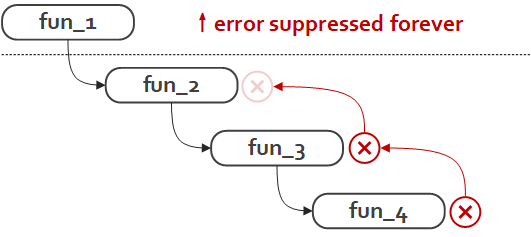
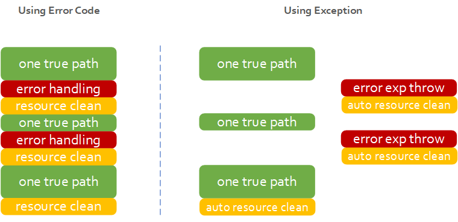

# 异常和错误处理

异常是现代编程语言大都支持的特性，它带来的最为直观的好处是，让代码变得更加简洁、干净。想象一下没有异常的话，所有函数的返回值都被错误码占用，连下标访问这种很直观的操作符重载语法都不再有效，这不能不说是一种遗憾。

```cpp
std::map<int, int> dict;

// with exception
int v = dict[2];

// without exception
int v;
int err = dict.get(2, v);
if(err != 0) {...}
else {...}
```

C++是一门特别的语言，它提供了异常支持，但C++编译器却大都没有实现自动垃圾回收，进而出现了一些资源管理方面的挑战。

## 从一个例子开始

以下是一个网络服务程序的示例，它从网络上接收一个请求包，然后原样发送回去，最后在成功处理后打印一条log。

```cpp
int ProcessConnection() {
    Request* req = new Request();
    if(0 != Receive(req)) {
        delete req;
        return -1;
    }
    Response* res = new Response();
    res.msg = req.msg;
    if(0 != Send(res))  {
        delete req;
        delete res;
        return -1;
    }
    printf("successfully processed message %s", req.msg.c_str());
    delete req;
    delete res;
    return 0;
}
```

该实现问题有二。

首先，频繁的错误码检查。在两处有网络IO的地方，它仔细检查了返回值是否为0来判断是否处理成功。如果失败，函数立即退出。Process函数虽然对Receive和Send中发生的非预期情况做了一些响应，实际上，只是保持了某种中立和沉默：除了将错误向更外层传递之外，没有别的选择。

综合整个函数掉栈来看，错误码的传递和检查的繁琐问题更加明显。调用链上游函数要对下游每个函数的每个错误负责，任何疏忽都将导致错误对上永久被“压制”。



除了已经检查的错误，仍然有两处可能发生错误的地方（概率较低）没有检查，很多现实中运行很好的代码都会忽略这两种情况下的错误处理。这表明，我们有时候不惜冒险以回避繁琐的错误码检查。
* [operator new](https://en.cppreference.com/w/cpp/memory/new/operator_new)可能因为内存不足返回空指针。
* [printf](http://www.cplusplus.com/reference/cstdio/printf/)函数因为IO错误返回<0的错误码。

其次，资源清理逻辑也显得比较机械和啰嗦。在函数的执行过程中，可能随时申请资源（内存、文件、socket等）。因此，在每一个可能发生错误的地方，已申请未释放的资源都可能有所不同，需要根据当前的资源残留情况，进行针对性的清理，操作必须十分小心。

## 如何改进

如果在不可恢复的错误发生时，有某种机制能够立即暂停程序、报告错误，并清理已经申请的资源，代码可以简化如下：

```cpp
void ProcessConnection() {
    Request* req = new Request();
    Receive(req);
    Response* res = new Response();
    res.msg = req.msg;
    Send(res);
    printf("successfully processed message %s", Packet.msg.c_str());
    return;
}
```

依靠两个重要的特性，C++实现了对以上想法的支持：

* 异常（Exceptipn）。在错误发生时抛出（throw）以终止执行并汇报出错信息。
* RAII。在异常发生时，释放其关联的资源。

## 异常和RAII

在发生异常时，开发者没有机会提供释放资源代码，安全的异常处理必须转而建立在对RAII的支持之上。

异常发生时，控制流从throw语句移至可处理异常的catch语句。随后，堆栈的展开(Stack Unwinding)过程开始。其中重要的一步是：利用RAII，对try语句块开始到异常引发点之间完全构造（但尚未析构）的所有对象进行析构。因此，有异常的地方，就该有RAII。

```cpp
// DO NOT
void NoRAII() {
    Object* obj = new Object();
    ...
    delete obj;
}

// DO
void RAII() {
    std::unique_ptr<Object> obj = std::make_unique<Object>();
    ...
}
```

## 异常和错误码

在使用错误码时，程序的正常业务逻辑（one true path/happy path）和错误处理逻辑是交织在一起的。异常本质上来说是为错误处理开辟了一个独立的处理信道，来实现one true path和错误处理逻辑的“分离”。

从这一点上来说，异常收获的好处是，大量“异常中立”的代码可以不必显示处理异常，同时也不会掩盖或压制可能发生的错误。



## 错误处理的不同方案

Error handling看起来只是一个编程习惯和风格问题，但其实这个话题从2000年开始就开始在学术界、工业界引起大量争论。这些争论和分歧，以及带来的影响，从很多地方都能感觉到。

boost file system库的所有API都提供了两个版本，一个异常版本，一个错误码版本，以满足不同需求。

```cpp
void copy(const path& from, const path& to);
void copy(const path& from, const path& to, system::error_code& ec);
```

大多数历史较短的语言都有异常机制，而go作为一门专注后台开发的年轻语言有些例外。go坚定地[拒绝异常](https://blog.golang.org/error-handling-and-go)，“Go solves the exception problem by not having exceptions.”。go认为开发者应该及时、明确、高效地处理自己程序中可能出现的任何错误。go提供了多返回值，可以用来增加一个类型为`error`的返回值，避免单一返回值被错误码占用的尴尬情况。

> In Go, error handling is important. The language's design and conventions encourage you to explicitly check for errors where they occur (as distinct from the convention in other languages of throwing exceptions and sometimes catching them).

大家常提的google [C++ style guide](https://google.github.io/styleguide/cppguide.html#Exceptions)对异常的使用给出了自己的意见。首先，开门见山：“We do not use C++ exceptions”。理由是异常总体来说利大于弊，但是我们有太多没有为异常准备好的代码，所以建议不要使用。

> On their face, the benefits of using exceptions outweigh the costs, especially in new projects. However, for existing code, the introduction of exceptions has implications on all dependent code. If exceptions can be propagated beyond a new project, it also becomes problematic to integrate the new project into existing exception-free code. Because most existing C++ code at Google is not prepared to deal with exceptions, it is comparatively difficult to adopt new code that generates exceptions.

C++的异常和RAII还直接导致了一些常见设计和约定，此处列举有三。

第一，使用额外的Init函数来构造对象，而不是构造函数本身。这是惯用错误码的人，既想使用C++的类又想避免异常，想出的一个方法（他们真正想要的是C with class）。既然构造函数没有返回值，无法通知错误，那就只在构造函数中做一些不可能发生异常的事情，将其他工作挪到一个叫`Init`的函数中。实际上，这破坏了RAII，即构造函数完成时并不代表对象构造完成，为此，又不得不增加`is_init`成员，并在每个接口函数中检查它。

第二，禁止析构函数抛出异常。析构函数被调用的场景有两个：对象离开作用域和异常栈展开。如果在异常栈展开时，析构函数再次抛出异常，将导致一个嵌套的异常处理流程，编译系统对此的应对是立即中止并退出进程。

第三，C++支持禁止异常。为了兼容C，g++ 提供编译选项`-fno-exceptions`在编译时禁止异常。operator new也有一个[无异常版本](http://www.cplusplus.com/reference/new/nothrow/)：`char* p = new (std::nothrow) char [UINT64_MAX]`。

## 争论

**错误码是历史包袱**

主张异常的一派说错误码是70年代的产物，之所以还被坚持使用，是因为害怕在项目中引入异常会导致和历史遗留代码难以整合。除此之外，异常通常更优。

**异常导致不可见的代码路径**

这确实是一个事实。异常导致了一条独立于代码逻辑本身的错误处理信道，光凭查看代码很难评估所有程序的控制流：函数返回点可能在你意料之外。这会导致代码审查、错误调试时的困难。

**异常难以正确使用**

如何正确地区分“正常错误”和“非正常错误”，也是使用异常的一个困难的地方。例如，对于二分查找程序，没有找到目标值是一个正常错误，应该用错误码来通知。而对于写文件时文件不可写，是一个“非正常错误”，应该选择抛出异常。

看起来似乎不算太难，但事情不总是这么清晰。例如，一个大并发的服务，应对用户的非法请求包时采用抛异常的方式处理，就可能导致异常处理流程频繁被触发而**影响性能**，此时，就要转而选择使用错误码。

**异常是毒品**

异常是语言的一项语法特性，这是一个加法。到了一些不支持或不允许使用异常的场合，做减法去掉异常非常困难，只能重写代码。惯用错误码的开发者以此骂异常机制是毒品，没有退出机制。


## 练习

**1.** 类的析构函数在哪些情况下会被调用？

为了保证了资源的安全释放，析构函数需要在以下两种情况下被调用：

* one true path上，当对象离开作用域时。
* 异常栈展开时，栈上完全构造但尚未析构的对象也会被析构。

**2.** C语言有异常支持吗？通常怎么处理错误？

**3.** 实现一个二分查找程序，在目标值不存在时，分别用抛出异常和返回错误码来通知错误。测试二者的性能差距。
