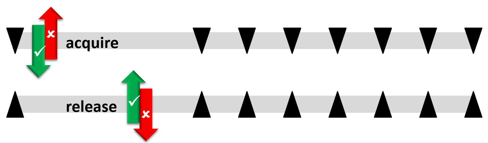
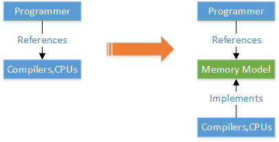
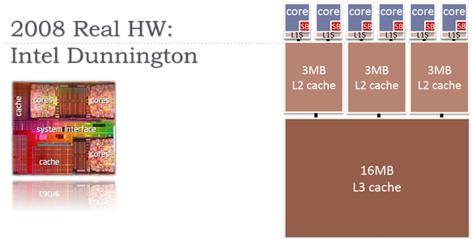
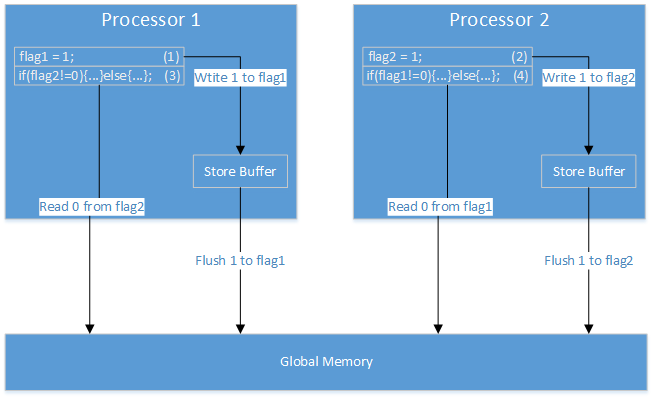

# Memory Order

开发运行在多核处理器上的多线程程序，对今天的开发者来说是再常见不过的事情。对多线程环境认识的不足很可能让我们在某些时候置自己的代码于危险之中，而我们却对此一无所知。本节将重提在多线程环境中，我们何时何处可能处于何种潜在危险之中，避免因为“无知无畏”导致难以排查和复现的并发错误。

下面这段有名的代码常用来展示一种错误的多线程通信模式。假设我们能确保对is_ready的读写是原子的（x86平台保证对齐的int读写是原子的），这段代码能够如预期那样工作吗？如果你的答案是可以，那你就需要继续读下去。

```C++
int message = 0;
int is_ready = 0;

// thread 1 : send a message.
void send_message()
{
    message = 42;   // (1)
    is_ready = 1;   // (2)
}

// thread 2 : receive the message sent by thread 1.
int try_recv_message()
{
    if(is_ready == 0){ return -1; }    // (3)
    return message;                    // (4)
}
```

## 代码乱序

如果颠倒(1)和(2)的执行顺序，整个代码就有可能按照(2)(3)(4)(1)的顺序执行，从而导致try_recv_message返回-1，发生线程间数据同步错误。这种现象称为**代码乱序或内存乱序(reordering, memory reordering)**，是并发程序中一个最基本的事实。

造成代码乱序的原因主要有两类。

首先，在编译时。编译器看到(1)和(2)之间没有依赖关系，可能将(2)提前到(1)之前执行，如果它觉得这样做更快的话。这类优化还有很多，对提升代码的执行速度至关重要。

其次，在运行时。即使编译器没有这样做，CPU在运行时会也可能会先执行(2)。(1)和(2)属于不相关操作，打乱顺序在单个CPU核心看来没有副作用。编译器的乱序优化可以通过禁用编译器优化来避免，而对于这类发生在运行时的乱序，我们是束手无策的。

以下两篇来自[Preshing on programming](http://preshing.com/)的文章对上述两类乱序做了非常好的科普。Preshing.com也是我目前发现的质量很高的并发编程知识源，用词准确、清晰。

* Memory Ordering at Compile Time[[cache]](Memory_Ordering_at_Compile_Time.html)[[link]](http://preshing.com/20120625/memory-ordering-at-compile-time/)
* Memory Ordering at Runtime: Memory Barriers Are Like Source Control Operations[[cache]](Memory_Barriers_Are_Like_Source_Control_Operations.html)[[link]](http://preshing.com/20120710/memory-barriers-are-like-source-control-operations/)

现在，一个疑问是，既然都导致了错误的结果，为什么这类乱序优化还会被允许？原因有两点。

第一，编译器在编译时，意识不到多线程环境，因而只能保证代码优化前后，在单线程环境下的行为一致。

第二，CPU核心独立运行自己的指令序列，没有其它核心的指令上下文，也只能保证自己核心上行为的正确性。另外，出于性能考虑，CPU不是直接与内存交互，之间隔有cache、store buffer等。这些中间层会引起数据同步问题，即多个核心可能看到同一个变量拥有不同的值（附I给出了一个store buffer导致代码乱序的例子）。

最终，在源代码层面上看，这些优化导致了一种现象：好像代码按照某种违反书写顺序的顺序被执行。

只要有多线程，编译时乱序就可能会导致问题，不论是单核多线程（以下称为并发，concurrent）还是多核多线程（以下称为并行，parallel）。而运行时乱序则只会在多核条件下导致问题，没有核心间共享数据则不存在数据一致性问题，单一核心又拥有运行其上所有线程的指令上下文，能够保证正确的运行时行为。

## 控制乱序 

为了应对乱序带来的问题，编译器和CPU都分别提供了专门的指令供开发者控制一些非预期的行为。

**compiler barrier/fence**

用于控制编译器乱序优化的指令通常称为“编译器栅栏”（compiler barrier/fence）。下面第5行的汇编语句就是常见的GCC栅栏指令，它会阻止编译器将其前后的代码移向另一侧。


```asm
int A, B;
void Foo()
{
    A = B + 1;
    asm volatile("" ::: "memory");
    B = 0;
}
```

**memory barrier/fence**

用于控制运行时代码乱序的指令通常称为“内存栅栏”（memory barrier/fence,CPU barrier/fence）。memory barrier通常也兼有compiler barrier的作用，而反过来compiler barrier是无法阻止运行时乱序的。实际上，在汇编代码中compiler barrier就已经不存在了。因此，多数时候，我们需要的是memory barrier。以下代码第4行的汇编指令就是GCC（PowerPC）的memory barrier指令，它会阻止位于它之前的代码跨越栅栏后的第一个写操作。

```C++
void send_value(int x)
{
    value = x;
    asm volatile("lwsync" ::: "memory");
    is_published = 1;
}
```

Memory barrier的类型有很多，最基本的有四类。[Memory Barriers Are Like Source Control Operations](http://preshing.com/20120710/memory-barriers-are-like-source-control-operations/)对这四类基本的barrier给出了非常形象的解释。


* LoadLoad barrier。阻止之前的任意一条读操作跨越之后的任意一条读操作。
* LoadStore barrier。阻止之前的任意一条读操作跨越之后的任意一条写操作。
* StoreLoad barrier。阻止之前的任意一条写操作跨越之后的任意一条读操作。
* StoreStore barrier。阻止之前的任意一条写操作跨越之后的任意一条写操作。

有些barrier[[link]](http://preshing.com/20130922/acquire-and-release-fences/)[[cache]](Acquire_and_Release_Fences.html)同时具有多种功能，典型的有如下两种：

* Acquire barrier/fence。同时具有LoadLoad和LoadStore功能。
* Release barrier/fence。同时具有LoadStore和StoreStore功能。

下面例子的第2行使用了C++ 11标准提供的栅栏指令，通过这个例子，我们来熟悉下上面的这些概念。


```C++
tmp = new Singleton;
std::atomic_thread_fence(std::memory_order_release);
m_instance = tmp;
```

第2行中的barrier是一个Release barrier，它同时具有LoadStore和StoreStore barrier的功能。这意味着它之前的Load/Store不能跨越之后的任意一条Store，换句话说，它之前的任何读写操作都必须在之后的首条写操作之前执行完成。最终达到的效果就是m_instance在被赋值为tmp之前，tmp一定已经指向了一个构造完成的Singleton对象。

除了有Acquire/Release fence之外，还有两个更常见的名词叫Acquire/Release semantic[[link]](http://preshing.com/20120913/acquire-and-release-semantics/)[[cache]](Acquire_and_Release_Semantics.html)。如果拿设计模式做简单类比的话，上面这些fence相当于具体的实现，而acquire/release semantic相当于接口：它是人们对某种顺序的定义，是在讨论并发编程时非常常见的通用术语。


> An operation has acquire semantics if other processors will always see its effect before any subsequent operation's effect. 
>
> An operation has release semantics if other processors will see every preceding operation's effect before the effect of the operation itself.

以下代码是对上面例子的另外一种实现，通过它我们认识下Acquire/Release semantic。第2行对m_instance的赋值，被称为“具有（或实现了）Release semantic”，它在对m_instance赋值的同时阻止了之前的代码向下穿越。这种实现了acquire/release semantic的操作被称为Acquire/Release operation。这些概念经常被搞混[[link]](http://preshing.com/20131125/acquire-and-release-fences-dont-work-the-way-youd-expect/)[[cache]](Acquire_and_Release_Fences_Dont_Work_the_Way_Youd_Expect.html)，需要格外注意用词。


```C++
tmp = new Singleton;
m_instance.store(tmp, std::memory_order_release);
```

最后，你可能还是对这么多barrier的具体行为感到难以区分，那就只记住用来沟通顺序的最常用术语：Acquire/Release semantic。如果即使是这二者，也难以区分的话，Herb Sutter针对C++ 11 atomic的演讲[[video]](http://channel9.msdn.com/Shows/Going+Deep/Cpp-and-Beyond-2012-Herb-Sutter-atomic-Weapons-1-of-2)[[ppt]](Atomic_Weapons_Memory_Model.pdf)中的一张图也许会帮到你。



## 内存模型

通过使用上述的barrier，可以控制代码的运行时顺序，但这样做的缺点很明显：太底层，不同的体系结构对他们的支持程度不一，对同一功能提供的指令也不同。我们不可能在写代码之前，通读不同品牌编译器和CPU的文档。因此，开发人员和软硬件体系（包括编译、CPU等）之间需通过达成某种协议或者说标准来解决问题。这个协议就是内存模型(Memory Model)[[link]](http://preshing.com/20120930/weak-vs-strong-memory-models/)[[cache]](Weak_vs_Strong_Memory_Models.html)。类比来看，就像设计模式中的依赖倒置原则：我们从依赖实现，转为依赖接口。



较早引入内存模型的Java对内存模型的官方定义[[link]](https://jcp.org/aboutJava/communityprocess/review/jsr133/index.html)[[cache]](java_memory_model-1_0-prd-spec.pdf)(page 15)是这样的：

>A memory model describes, given a program and an execution trace of that program, whether the execution trace is a legal execution of the program.
>
>内存模型描述给定程序的某个特定的执行轨迹是否是该程序的一个合法执行。

这个定义有点学术，通俗来讲，它其实定义了各方的行为准则：

* 软硬件体系(编译器，CPU等)，需要保证实现某种内存模型。所谓“实现”，并非必须按照内存模型定义的顺序执行代码，而是只要提供某种“假象”，即保证“看起来像是”按照内存模型执行。这给软硬件体系留出了一些优化空间。
* 开发人员，只要遵循这种内存模型，就可以开发出行为符合预期的程序。

Memory model是个复杂的话题，对于普通开发者来说，了解以下两点后大可止步于此。关于memory model，本节剩余部分会对SC和SC-DRF给出更多解释。

* 总的来说，memory model是想对代码的执行顺序作出规范。
* Java和C++ 11的默认内存模型叫做sequential consisteny for data race free（SC-DRF）。在SC-DRF保证下，只要我们保证所有线程间共享变量没有data-race（即同时读写），我们就拥有了一个我们熟悉的“假象”：线程内代码按照顺序执行，线程间代码按照某种交错执行。

**顺序一致性模型（sequential consisteny，SC）**

>… the result of any execution is the same as if the operations of all the processors were executed in some sequential order, and the operations of each individual processor appear in this sequence in the order specified by its program.

这是顺序一致性模型的提出者Lamport给出的官方定义。通俗来讲，它定义了两件事：

* 每个线程内部，代码按照按书写的先后顺序（program order）执行。
* 线程之间代码可以任意交错，但是所有线程所看见的整个程序的全局执行顺序必须是同一个。

SC是最容易被理解的内存模型，实际上，它就是我们直觉上期望的多线程代码的运行方式。

**SC-DRF**

保证SC的代价是巨大的。这相当于禁止软硬件体系做任何优化：所有的操作严格按照代码顺序执行，所有的操作都触发Cache Coherence以确保变量跨线程的同步。

实际上，在一个线程内部，几乎绝大多数的操作都是读写局部变量，这些变量对其它线程不可见。关键的只是共享变量。于是，SC-DRF被提出了。

如果代码没有Data-Race，就保证拥有顺序一致性。 Data-Race是指，有共享变量被两个或以上线程同时读或写，且其中至少有一个线程有写操作。对于程序员来说，其意义就是一句话：只要写出没有data-race的代码，就可以按照顺序一致性来推理代码的执行行为。

## 如何正确地进行多线程编程

现在，我们已经了解了多线程代码可能存在的乱序风险，以及一些基本的应对方式。现在问题是，面对一个需要多线程实现的需求，我们如何保证正确的代码执行顺序和数据同步？做到这些有很多选择：

* 使用诸如mutex的锁机制。
* 使用语言提供的并发机制（如C++ 11 atomic），实现无锁并发。
* 使用compile barrier、memory barrier等底层指令。

**使用锁**

锁是首选的方式。在没有深入了解过代码顺序、内存模型等等概念的前提下，我们依然正确地使用了很多年的锁。如果我们对所有共享变量加锁，就能够保证data-race free，进而保证代码拥有顺序一致性。而一旦拥有了顺序一致性，对代码正确性的证明就变得简单。下面的代码使用锁修正了本文开头例子存在的潜在问题。

```C++
int message = 0;
int is_ready = 0;
std::mutex mtx;

// thread 1 : Send a message.
void send_message()
{
    std::lock_guard<std::mutex> lck (mtx);
    message = 42;   // (1)
    is_ready = 1;   // (2)
}

// thread 2 : Receive the message sent by thread 1.
void try_recv_message()
{
    std::lock_guard<std::mutex> lck (mtx);
    if(is_ready == 0){return;}     // (3)
    int msg_recv = message;        // (4)
}
```

类似本文开头那样，对简单类型的共享数据放弃加锁的场景，偶尔是能够见到的。开发人员可能觉得自己对平台有足够的自信，确信在x86上，对is_ready的读写是原子的且不会发生reorder，因此这样的代码在x86平台上不加锁也能够正常运行。

通过利用这些特定平台的特性实现，可以实现一些无锁并发的数据结构。这些代码在一些平台上能够正常运行，在另一些平台上则可能偶然出现令人费解的错误，这类错误将会非常难以排查。任何平台的保证都不如遵循标准来的强有力，尤其是希望写出跨平台代码的时候。

**保证顺序一致性**

如果使用锁导致了不能接受的性能问题，我们可能会不得已迈入无锁并发编程（lock-free）的世界。

对于无锁并发编程[[link]](http://preshing.com/20120612/an-introduction-to-lock-free-programming/)[[cache]](An_Introduction_to_Lock_Free_Programming.html)，首先要明确的一点是，这是一件困难的事。要实现无锁数据结构和算法，必须对内存模型有深入的了解，并且需要一定的理论功底来对代码的正确性进行证明（reasoning），要小心避免由于知识储备不足带来的风险。

大多数场景下，无锁编程也不见的必要。无锁无非是要追求极致的性能，而这类需求只在服务器后端、图形计算等一小部分领域中存在。很难想象，我们会花3天的时间为一个手机端app实现一个无锁hash表来提高响应速度。Linus在2014年的一个帖子[[cache]](linus_avoid_ping_pong.html)[[link]](https://www.realworldtech.com/forum/?threadid=146066&curpostid=146227)更是对并行编程（Parallel Programming）进行了无情地抨击。

> 并行只对图形计算、服务器有意义，而在这些领域我们已经大量应用并行了。
>
> 把并行推广到其他的领域没有意义。所以说忘记并行吧。它不会到来的。4个左右的核心对终端用户来说没有问题，在移动领域里，不大幅增加能耗的情况下，你没办法再塞进更多的核心。
>
> 是否要讲究程序的并行性根本就是谬误，其前提条件都是错误的。它只不过是一个早该过时的时髦术语罢了。

如果我们确信，必须采用无锁编程才能提高性能了，首选的方式是，保证对所有共享变量的读写没有冲突（例如对于C++，将所有共享变量申明为atomic），并且采用默认的内存模型SC-DRF，此时就拥有了SC，没有memory reordering，进而大大简化对代码正确性的推理。对于本文开头的例子，一个正确的无锁实现如下：

```C++
std::atomic<int> message = 0;
std::atomic<int> is_ready = 0;

//Thread 1 : Send a message.
void send_message()
{
    message.store(42, memory_order_seq_cst);   // (1)
    is_ready.store(1, memory_order_seq_cst);   // (2)
}

//Thread 2 : Receive the message sent by thread 1.
void try_recv_message()
{
    if(0 == is_ready.load(memory_order_seq_cst)){return;}      // (3)
    int msg_recv = message.load(memory_order_seq_cst);         // (4)
}
```

**弱内存模型，人工保证ordering**

如果SC的性能仍然不能满足需求，我们将不得已落入一个充满危险和困难的境地：没有SC，需要小心地人工处理memory reordering。此时，首选的方式是采用语言标准层面提供的同步机制。对C++而言，虽然C++ 11默认实现SC-DRF，但它也为其它较弱的内存模型提供语言标准级别的支持。相比之下，直接使用平台提供的barrier是最不推荐的方式，它太底层，太繁琐，且影响代码可移植性。下面是本文开头的例子在没有SC保证时的实现。


```C++
int message = 0;
std::atomic<int> is_ready = 0;

// thread 1 : send a message.
void send_message()
{
    message = 42;  // (1)
    is_ready.store(1, memory_order_release);   // (2)
}

// thread 2 : receive the message sent by thread 1.
void try_recv_message()
{
    if(0 == is_ready.load(memory_order_acquire)){return;}      // (3)
    int msg_recv = message;         // (4)
}
```

虽然看似和SC条件下的实现差别很小，但对这段代码进行正确性推理，需要了解Synchronizes-With Relation[[link]](http://preshing.com/20130823/the-synchronizes-with-relation/)[[cache]](The_Synchronizes_With_Relation.html)和Happens-Before Relation[[link]](http://preshing.com/20130702/the-happens-before-relation/)[[cache]](The_Happens_Before_Relation.html)。

到这里，我们必须要结束没完没了的讨论了。最为最后的提示，在下手多线程编程时，尤其是有机会无锁编程的时候，不要忘记更加周全的考虑。

## 附I CPU store buffer导致代码乱序一例

即使编译器和CPU都严格按照顺序编译和执行代码，CPU核心间共享数据的一致性问题仍然会导致代码乱序。

下图是一颗在Intel Dunnington CPU，所有核心共享16M L3缓存，每两个核心共享一个3M L2缓存，每个核有自己的一个L1缓存，同时还有自己的store buffer。这导致共享数据的可见性和一致性成为严重的问题：线程1对变量的写操作不能立即被线程2看见。



现代硬件都提供完全相关的cache，即在硬件层面上保证CPU cache数据的一致性，但Store buffer仍会导致逻辑上的代码乱序。



我们按照下面的流程来执行这段程序，就会让Processor1和Processor2同时进入临界区。

- Processor1执行(1)，将1写入Store Buffer中的flag1。
- Processor1执行(2)，将1写入Store Buffer中的flag2。
- Processor1执行(3)，从内存中读取到flag2=0，进入临界区。
- Processor2执行(4)，从内存中读取到flag1=0，进入临界区。

